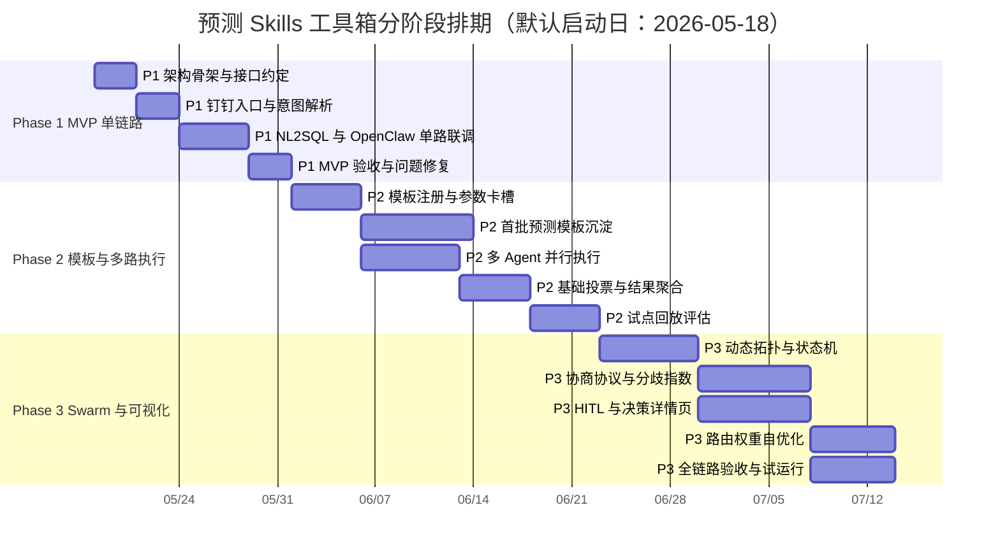

# 详细需求与开发计划

> 排期假设：[待业务确认: 默认项目启动日=2026-05-18]。  
> 技术边界：计算只下发 OpenClaw；数据只走 NL2SQL；编排层只做调度、状态、协议、审计；交互只走钉钉/OpenClaw 原生对话入口。

## 3.1 分阶段实施总览 [P0]

| Phase | 预计周期 | 核心目标 | 里程碑 | 交付物清单 |
|---|---:|---|---|---|
| Phase 1：MVP 单链路跑通 | 2 周 | 验证“钉钉 → 编排层 → NL2SQL → OpenClaw 单路执行 → 钉钉返回”可行 | 可对单场地 T+1/T+2 返回预测结果 | FastAPI 网关、钉钉 Webhook、NL2SQL 文本取数、OpenClaw 单任务适配、基础 SQLite、基础日志 |
| Phase 2：参数化模板 + 多路执行 + 基础投票 | 4 周 | 建立“框架 × 方法 × 维度”模板体系，实现 3~5 路并行 Agent 与基础投票 | 可对试点场地输出主值 + 备选值 + Agent 主张 | 模板注册表、Jinja2 模板库、Agent Registry、并发调度、主张解析、基础加权投票、模板评估报表 |
| Phase 3：Agent Swarm 自主协同 + 全链路可视化 | 5 周 | 实现动态拓扑、多轮协商、HITL、路由权重自优化和决策轨迹可视化 | 可支撑试点运营闭环和审计复盘 | LangGraph 状态机、协商协议、分歧指数、人工校验台、Agent 表现分析、决策详情页、告警与自优化 |

Phase 依赖关系：

| 依赖关系 | 说明 | 验收节点 |
|---|---|---|
| Phase 1 → Phase 2 | 必须确认 NL2SQL 与 OpenClaw 指令协议稳定，才能批量沉淀模板 | 单场地单 Agent 链路成功率 ≥ 95% |
| Phase 2 → Phase 3 | 必须具备结构化 Agent 主张和基础投票，才能做协商与可视化 | 3~5 Agent 并行执行成功，主值可解释 |
| Phase 3 → 试运行 | 必须具备 HITL、审计、告警和回放能力 | 试点场地连续 7 天任务可复盘 |

## 3.2 Phase 1：MVP 单链路跑通 [P0]

目标：证明“编排层 → NL2SQL 取数 → OpenClaw 单路执行 → 钉钉返回”链路可行。范围只覆盖 1~2 个试点场地、1 个基础模板、单 Agent 执行。

| 需求编号 | 需求描述 | 优先级 | 负责模块 | 预估人/天 | 前置依赖 | 验收标准 |
|---|---|---:|---|---:|---|---|
| P1-ORC-001 | 搭建 FastAPI 编排服务骨架，生成 task_id/trace_id | P0 | 编排网关 | 2 | 无 | 本地启动服务，健康检查接口 200，所有请求有 trace_id |
| P1-DDB-001 | 接入钉钉 Webhook，解析用户消息并返回文本/卡片 | P0 | 钉钉入口 | 3 | 钉钉机器人权限 | 输入“预测明天到件量”后 3 秒内返回受理消息 |
| P1-ORC-002 | 实现场地、日期、用户归属基础意图解析 | P0 | 意图解析器 | 3 | 用户-场地映射表 | 默认识别所属场地和 T+1/T+2，准确率 ≥ 95% |
| P1-SEC-001 | 建立用户-场地-角色映射和基础权限校验 | P0 | 权限与用户映射模块 | 2 | 用户组织信息 | 场地运营仅能查看所属场地，越权请求被拒绝并记录审计 |
| P1-N2S-001 | 封装 NL2SQL 文本指令调用 | P0 | NL2SQL 适配器 | 3 | NL2SQL 地址/鉴权 | 可返回指定场地近 7/14/28 天 JSON/CSV 数据 |
| P1-N2S-002 | 实现 NL2SQL 返回结果基础校验 | P0 | 数据校验器 | 2 | P1-N2S-001 | 识别空结果、字段缺失、格式错误，并写日志 |
| P1-OCA-001 | 封装 OpenClaw API/CLI 单任务提交 | P0 | OpenClaw Adapter | 4 | OpenClaw 调用方式确认 | 成功提交 Python 脚本并拿到 openclaw_task_id |
| P1-OCA-002 | 实现 OpenClaw 结果轮询与 marker 解析 | P0 | OpenClaw Adapter | 3 | P1-OCA-001 | 可解析 `__PREDICTION_RESULT__` 并转标准 JSON |
| P1-TPL-001 | 内置 1 个固定模板 `F1_M1_site_total` | P0 | 模板引擎 | 2 | 历史到件数据可用 | 模板生成脚本，OpenClaw 输出单预测值 |
| P1-DB-001 | 建立 SQLite 基础表：prediction_task、audit_log | P0 | 状态存储 | 2 | 表结构确认 | 任务发起、完成、失败均可落库 |
| P1-OBS-001 | 实现基础日志与耗时统计 | P0 | 观测采集器 | 2 | trace_id | 可查看钉钉、NL2SQL、OpenClaw 分段耗时 |
| P1-DDB-002 | 返回钉钉预测结果卡片 | P0 | 钉钉响应器 | 2 | P1-OCA-002 | 卡片包含场地、日期、预测值、数据窗口、trace_id |
| P1-QA-001 | Phase 1 端到端回归用例 | P0 | QA/联调 | 3 | 所有 P1 模块 | 20 次请求成功率 ≥ 95%，失败可定位到具体环节 |

技术风险与 Spike 任务：

| Spike 编号 | 不确定性 | 验证方式 | 退出标准 |
|---|---|---|---|
| SP1-OCA | OpenClaw API/CLI 是否支持直接注入 Python 字符串 | 用最小脚本提交并拉取 stdout | 1 天内确认调用方式与错误码 |
| SP1-N2S | NL2SQL 是否稳定返回可解析 JSON/CSV | 构造 5 类文本指令测试 | 90% 请求可解析；失败模式明确 |
| SP1-DDB | 钉钉卡片按钮与回调权限 | 创建测试机器人和卡片 | 可点击“查看详情/确认”并回调编排层 |
| SP1-DATA | 试点场地字段口径是否统一 | 抽样近 28 天数据 | date/site/volume 三字段完整率 ≥ 95% |

Phase 1 联调检查点：

| 检查点 | 时间点 | 检查内容 | 通过标准 |
|---|---|---|---|
| CP1.1 | 第 3 天 | FastAPI + 钉钉消息接入 | 能收到消息并返回 trace_id |
| CP1.2 | 第 7 天 | NL2SQL 取数链路 | 可取到试点场地历史数据 |
| CP1.3 | 第 10 天 | OpenClaw 单脚本执行 | 可执行模板脚本并返回预测 JSON |
| CP1.4 | 第 14 天 | 端到端验收 | 钉钉触发到卡片返回 ≤ 3 分钟 |

## 3.3 Phase 2：参数化模板 + 多路执行 + 基础投票 [P0]

目标：实现“框架 × 方法 × 维度”组合引擎、多路并行执行、结果聚合与基础加权投票。

| 需求编号 | 需求描述 | 优先级 | 负责模块 | 预估人/天 | 前置依赖 | 验收标准 |
|---|---|---:|---|---:|---|---|
| P2-DB-001 | 建立 template_registry、agent_registry、agent_claim、vote_record、route_weight | P0 | SQLite | 3 | P1-DB-001 | 表结构可迁移，支持模板/Agent 查询 |
| P2-TPL-001 | 实现 Jinja2 模板目录、版本号、manifest 管理 | P0 | 模板引擎 | 4 | P2-DB-001 | 可按 template_id 加载指定版本 |
| P2-TPL-002 | 实现参数卡槽校验与安全注入 | P0 | 模板引擎 | 4 | P2-TPL-001 | 缺失必填卡槽时报错；危险参数无法注入 |
| P2-TPL-003 | 实现预测模板配置台最小后台能力 | P0 | 管理看板服务/模板引擎 | 4 | P2-TPL-001 | 管理员可启停模板、查看模板版本、修改默认参数并写审计 |
| P2-RUL-001 | 实现框架×方法×维度合法性校验 | P0 | 组合规则引擎 | 4 | Agent Registry | 非法组合被拦截并给出原因 |
| P2-AGT-001 | 建立首批 Agent Registry | P0 | Agent 注册表 | 3 | 模板清单确认 | 至少注册 5 个 Agent，含适用场地/事件/字段 |
| P2-OCA-001 | 实现 AsyncIO 多路并行 OpenClaw 调度 | P0 | OpenClaw 调度器 | 5 | P1-OCA-002 | 3~5 路并发成功率 ≥ 95% |
| P2-OCA-002 | 实现超时、重试、失败降级标记 | P0 | OpenClaw 调度器 | 4 | P2-OCA-001 | 模拟超时后不中断整体任务 |
| P2-CLM-001 | 实现 Agent Claim 标准化解析和入库 | P0 | 主张收集器 | 3 | P2-OCA-001 | 每个 Agent 输出符合 claim schema |
| P2-VOT-001 | 实现基础加权投票 | P0 | 投票器 | 4 | P2-CLM-001 | 输出主值、备选 Top3、投票权重 |
| P2-AGG-001 | 实现结果聚合与钉钉多 Agent 卡片 | P0 | 结果聚合器 | 3 | P2-VOT-001 | 卡片展示主值、备选值、Agent 共识度 |
| P2-N2S-001 | 增加 Parquet 缓存和 TTL 清理 | P1 | NL2SQL 适配器 | 3 | P1-N2S-001 | 2 小时内相同查询命中缓存 |
| P2-OBS-001 | 增加 Agent 级耗时、失败率、分歧指数日志 | P1 | 观测采集器 | 3 | P2-OCA-001 | 可按 trace_id 查看每个 Agent 状态 |
| P2-QA-001 | 历史数据回放与模板准确率评估 | P0 | QA/数据分析 | 5 | 首批模板完成 | 输出每个模板 MAPE、失败率、适用场景 |

模板沉淀计划：

| 模板编号 | Agent 示例 | 参数组合 | 适用场景 | 验证策略 |
|---|---|---|---|---|
| TPL-01 | TrendFollower | F1 × M1 基期同环比 × 场地整体 | 通用平峰预测 | 用近 60 天滑窗回放，统计 T+1 MAPE |
| TPL-02 | ShiftSplitter | F1/F6 × M1 × 班次/白晚班 | 多班次人力排布 | 校验班次占比稳定性，偏差阈值 ≤ 10% |
| TPL-03 | CapacityPlanner | F2 × M2 规划运力 × 集散 | 运力驱动场地 | 对比规划车次与实际到件关系 |
| TPL-04 | InTransitEstimator | F1/F3 × M3 在途运力 × 班次/库区 | 干线 ETA 明显场景 | 检查 ETA 字段完整率和短期预测偏差 |
| TPL-05 | CustomerSurvey | F2/F4/F5 × M4 客户摸底 × 集散/经济圈 | 大客户依赖型 | 对比客户上报、修正后、实际件量 |
| TPL-06 | HistoryMirror | F5 × M1+M4 × 经济圈/白晚班 | 浦江/三鲁类片区场地 | 验证双代码场地合并风险提示 |

模板准确率评估方法：

| 指标 | 计算方式 | 通过标准 |
|---|---|---|
| MAPE | `avg(abs(pred-actual)/actual)` | 首批模板试点 MAPE ≤ 15% [待业务确认] |
| 可执行成功率 | `成功执行次数/总执行次数` | ≥ 98% |
| 结果可解释完整率 | `含 reasoning/risk/key_inputs 的主张数/总主张数` | ≥ 95% |
| 离群率 | `离群结果数/总结果数` | ≤ 10% |
| 模板适用性 | 人工抽检场景匹配 | 试点运营确认通过 |

## 3.4 Phase 3：Agent Swarm 自主协同 + 全链路可视化 [P1]

目标：实现动态拓扑构建、多轮协商辩论协议、分歧指数计算、全链路决策树可视化、HITL 人工介入台和路由权重自优化。

| 需求编号 | 需求描述 | 优先级 | 负责模块 | 预估人/天 | 前置依赖 | 验收标准 |
|---|---|---:|---|---:|---|---|
| P3-SWM-001 | 搭建 LangGraph 状态机工作流 | P0 | Swarm 状态机 | 5 | P2 全链路 | 状态可从任务接收到结果输出完整流转 |
| P3-SWM-002 | 实现动态拓扑构建器 | P0 | 拓扑构建器 | 5 | agent_registry/route_weight | 每次任务动态选择 3~5 个 Agent 并说明原因 |
| P3-SWM-003 | 实现 Agent fallback 与降级策略 | P0 | 拓扑构建器 | 3 | P3-SWM-002 | 模拟 Agent 不可用时自动补位 |
| P3-DEB-001 | 实现分歧指数计算和高分歧触发规则 | P0 | 协商引擎 | 3 | P2-VOT-001 | 分歧指数 > 阈值时进入协商 |
| P3-DEB-002 | 实现 1~N 轮协商 refine 协议 | P1 | 协商引擎/OpenClaw 调度器 | 6 | P3-DEB-001 | 最多 3 轮；每轮主张变化可追踪 |
| P3-DEB-003 | 实现投票僵局降级策略 | P1 | 投票器 | 3 | P3-DEB-002 | 高分歧不收敛时输出中位数兜底并触发 HITL |
| P3-HITL-001 | 实现人工校验台后端接口 | P0 | HITL 网关 | 4 | P2-AGG-001 | 支持调整值、原因、事件标签入库 |
| P3-HITL-002 | 实现人工调整钉钉卡片/回调 | P0 | 钉钉入口 | 4 | P3-HITL-001 | 用户可在钉钉完成确认/调整 |
| P3-EVT-001 | 实现异常事件标注台与事件标签记录 | P1 | 事件标签管理模块 | 4 | P3-HITL-001 | 可维护促销、天气、倒货、规划变更标签，并在下一次路由中生效 |
| P3-UI-001 | 实现决策详情页：Agent 主张对比 | P1 | 前端/看板 | 5 | P2-CLM-001 | 展示预测值、置信度、依据、风险 |
| P3-UI-002 | 实现协商过程时间线 | P1 | 前端/看板 | 5 | P3-DEB-002 | 可查看每轮分歧指数和主张变化 |
| P3-UI-003 | 实现代码片段与数据摘要折叠区 | P1 | 前端/看板 | 4 | template_registry/OpenClaw 引用 | 可查看模板版本、参数、OpenClaw 产物引用 |
| P3-AUD-001 | 实现决策轨迹审计页与状态快照查询 | P1 | 管理看板服务/审计模块 | 4 | audit_log/state_snapshot | 可按 trace_id 回放任务解析、取数、执行、协商、投票、人工调整 |
| P3-ANA-001 | 实现 Agent 表现分析台 | P1 | 分析看板 | 5 | 历史任务数据 | 展示 MAPE、采纳率、降级次数、权重趋势 |
| P3-RISK-001 | 实现区域风险总览 | P2 | 管理看板服务/分析看板 | 4 | P3-ANA-001 | 区域经理可查看未来 2 天高分歧、低置信、需 HITL 的场地列表 |
| P3-OCX-001 | 接入 OpenClaw 原生对话补充入口 | P2 | FastAPI 网关/意图解析器 | 3 | OpenClaw 对话入口权限 | OpenClaw 对话文本可转成标准预测请求，且不触发 OpenClaw LLM 生成代码 |
| P3-OPT-001 | 实现路由权重自优化任务 | P1 | 路由权重服务 | 4 | 实际件量回流 | 每日更新 route_weight，变化有审计 |
| P3-OBS-001 | 实现钉钉告警策略 | P1 | 观测采集器 | 3 | P2-OBS-001 | OpenClaw/NL2SQL/高分歧事件可告警 |
| P3-QA-001 | 连续 7 天试运行和复盘报告 | P0 | QA/业务试点 | 7 | P3 核心功能完成 | 试点任务成功率 ≥ 95%，所有异常可追溯 |

Agent 协商协议验证方案：

| 验证项 | 测试方法 | 通过标准 |
|---|---|---|
| 协商触发准确性 | 构造低/中/高分歧样本 | 高分歧样本 100% 触发协商，低分歧不误触发 |
| 收敛性 | 回放历史 100 个任务，比较协商前后分歧指数 | 平均分歧指数下降 ≥ 20% [待业务确认] |
| 质量提升 | 对比协商前主值 MAPE 和协商后主值 MAPE | 协商后 MAPE 不劣于协商前，且高分歧样本改善 |
| 稳定性 | 模拟 1 个 Agent 离群、1 个 Agent 超时 | 主流程不中断，输出降级事件 |
| 可解释性 | 抽检协商记录 | 每轮都有 peer_summary、变更 Agent、变更理由 |
| 僵局处理 | 构造多 Agent 两极分化样本 | 触发中位数兜底 + HITL，不能无限循环 |

## 3.5 依赖管理与风险预案 [P0]

外部依赖清单：

| 依赖项 | 当前状态 | 风险等级 | 风险描述 | 预案措施 |
|---|---|---|---|---|
| OpenClaw API/CLI | 已部署，接口细节待确认 | 高 | 不支持脚本字符串注入、状态轮询或产物读取格式不稳定 | Phase 1 Spike 优先验证；封装 Adapter；必要时走 CLI fallback |
| OpenClaw Python 环境 | 已有沙箱，依赖包未知 | 高 | numpy/pandas/pyarrow 等依赖可能缺失或版本冲突 | 模板首批只依赖标准库+numpy；缺包模板禁用；依赖清单前置确认 |
| NL2SQL 接口 | 已有，纯文本入参 | 高 | 查询超时、字段缺失、不支持复杂 JOIN/子查询 | 编排层拆成简单指令；Parquet 缓存；缺字段降级 Agent |
| 钉钉开放平台 | 需企业权限 | 中 | 卡片回调、机器人权限、群聊范围受限 | Phase 1 建测试机器人；关键功能保留长消息 fallback |
| 试点场地数据口径 | 待业务确认 | 高 | 到件/发件、集散、白晚班口径不统一 | 建口径映射表；不确定字段标记风险，不参与强计算 |
| 实际件量回流 | 待接入 | 中 | 无实际值则无法计算 MAPE 和更新权重 | Phase 2 先用离线回放；Phase 3 接入每日实际件量文件/查询 |
| 业务事件标签 | 待沉淀 | 中 | 大客户、倒货、天气、规划变更依赖人工输入 | HITL 必填原因；后续沉淀事件字典 |

技术风险矩阵：

| 风险描述 | 发生概率 | 影响程度 | 缓解措施 | 负责人 |
|---|---|---|---|---|
| OpenClaw 接口限制导致无法稳定执行 Python | 中 | 高 | Adapter 双模式 API/CLI；Phase 1 最早验证；保留手动执行诊断脚本 | 后端负责人 |
| NL2SQL 查询超时或返回异常 | 高 | 高 | 拆分查询、缓存、缩短窗口、降级模板、触发 HITL | 数据接口负责人 |
| Python 依赖冲突导致模板执行失败 | 中 | 中 | 模板依赖白名单；首批模板轻依赖；执行前静态检查 | 模板负责人 |
| 数据质量波动导致预测不可用 | 高 | 高 | 数据完整度评分；缺失字段降权；高缺失触发人工主导模式 | 数据质量负责人 |
| 协商死锁或多轮不收敛 | 中 | 中 | 最大轮次=3；分歧无改善则中位数兜底 + HITL | 算法/Agent 负责人 |
| 投票权重被少量样本带偏 | 中 | 中 | 权重上下限、衰减、最小样本量门槛、人工审核异常漂移 | 算法/数据负责人 |
| 钉钉交互卡片不稳定 | 中 | 中 | 长消息 fallback；详情页 URL fallback；失败重发 | 前端/交互负责人 |
| 编排层误执行计算逻辑 | 低 | 高 | 代码审查规则：预测计算只允许在模板脚本中，并下发 OpenClaw 执行 | 架构负责人 |
| 审计链路缺失 | 中 | 高 | 每个状态节点写 audit_log；trace_id 强制透传 | 后端负责人 |

## 3.6 资源预估与排期 [P1]

角色需求表：

| 角色名称 | 职责描述 | Phase 1 投入 | Phase 2 投入 | Phase 3 投入 |
|---|---|---:|---:|---:|
| 技术负责人/架构师 | 架构边界、接口协议、方案评审、关键风险兜底 | 4 | 6 | 6 |
| 后端工程师 | FastAPI、状态机、SQLite、Adapter、HITL 后端 | 10 | 18 | 20 |
| 数据/算法工程师 | 模板沉淀、参数卡槽、评估回放、投票与权重优化 | 5 | 18 | 16 |
| 前端/交互工程师 | 钉钉卡片、详情页、人工校验台、分析看板 | 4 | 8 | 18 |
| 测试工程师 | 接口测试、回归测试、异常注入、试运行报告 | 4 | 8 | 10 |
| 业务产品/运营专家 | 场地口径确认、模板验收、人工调整规则、试点反馈 | 5 | 10 | 12 |
| DevOps/运维 | 部署、日志、告警、权限、环境配置 | 2 | 4 | 5 |

关键路径分析：

| 关键路径任务 | 原因 | 是否可并行 |
|---|---|---|
| OpenClaw 调用方式确认 | 决定所有模板执行与调度方案 | 不可并行，Phase 1 必须优先 |
| NL2SQL 基础取数稳定 | 决定模板输入和数据质量评分 | 不可并行，需早于模板验证 |
| Agent Claim Schema 定稿 | 决定投票、协商、可视化的数据结构 | 不可并行，Phase 2 开始前冻结 v1 |
| 模板注册与卡槽机制 | 决定多 Agent 是否可规模化 | 部分可并行，但需先完成 Registry |
| 多路执行调度 | 基础投票和 Swarm 的前置 | 不可并行 |
| 基础投票 | 协商协议和 HITL 判断的前置 | 不可并行 |
| HITL 审计闭环 | 试运行和业务采纳的前置 | 不可并行 |
| 实际件量回流 | 路由权重自优化的前置 | 可与 UI 并行，但影响 Phase 3 完整验收 |

联调节点与里程碑 Review 计划：

| 日期 | 里程碑名称 | Review 内容 | 参与角色 |
|---|---|---|---|
| 2026-05-20 | 接口协议 Review | 钉钉、NL2SQL、OpenClaw Payload、Claim Schema v1 | 架构师、后端、数据、运维 |
| 2026-05-27 | Phase 1 中期联调 | 钉钉入口、NL2SQL 取数、OpenClaw 最小脚本 | 后端、测试、运维 |
| 2026-05-29 | Phase 1 验收 | 单场地单 Agent 端到端链路、耗时、失败定位 | 全体 + 试点运营 |
| 2026-06-05 | Phase 2 模板 Review | 首批模板、参数卡槽、合法组合、模板风险 | 架构师、数据、业务产品 |
| 2026-06-12 | Phase 2 多路执行 Review | 3~5 Agent 并行、超时降级、主张入库 | 后端、数据、测试 |
| 2026-06-26 | Phase 2 验收 | 多 Agent 主值/备选值/基础投票，历史回放报告 | 全体 + 区域经理 |
| 2026-07-03 | Phase 3 状态机 Review | 动态拓扑、状态快照、异常转移 | 架构师、后端、测试 |
| 2026-07-10 | 协商与 HITL Review | 分歧指数、协商轮次、人工调整审计 | 数据、后端、业务产品 |
| 2026-07-17 | 可视化 Review | 决策详情页、Agent 表现分析、告警卡片 | 前端、产品、区域经理 |
| 2026-07-31 | Phase 3 试运行验收 | 连续 7 天任务、MAPE、采纳率、异常复盘 | 全体 + 试点场地负责人 |
