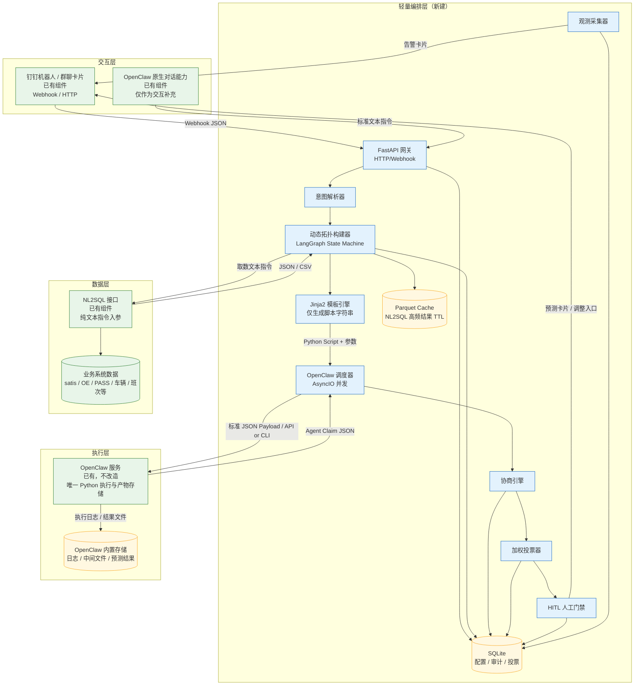
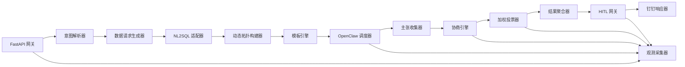
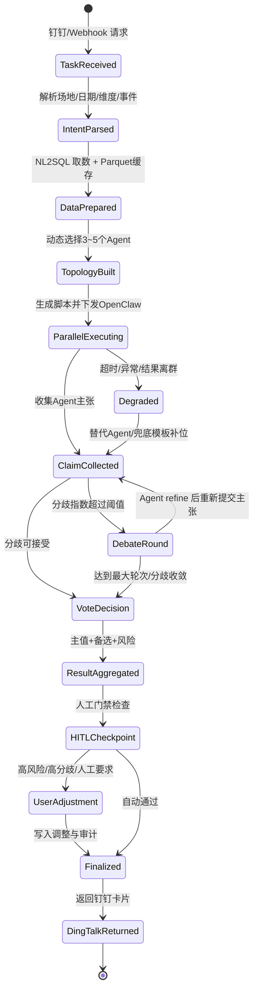

# 📗 2. 技术开发方案文档（Technical Spec）

## 2.1 整体架构图 [P0]



边界说明：

| 边界 | 规则 |
|---|---|
| 计算边界 | 所有预测公式、统计计算、Agent 独立预测必须在 OpenClaw 执行 Python 脚本完成 |
| 编排边界 | 编排层只做路由、模板填参、任务调度、主张聚合、协商投票、HITL 与审计 |
| 数据边界 | 编排层只能通过 NL2SQL 纯文本指令取数，不直连业务库 |
| 存储边界 | OpenClaw 存储执行日志和产物；SQLite 只存配置、状态、审计；Parquet 只做短 TTL 查询缓存 |
| 禁区 | 不改造 OpenClaw；不使用 OpenClaw 内置 LLM 生成预测代码；不在编排层重复实现预测计算 |

## 2.2 分层设计与组件职责矩阵 [P0]

| 组件名 | 所属层 | 职责描述 | 技术栈 | 部署形态 | 新建/已有 |
|---|---|---|---|---|---|
| 钉钉机器人 | 交互层 | 接收用户预测请求，返回结果卡片、详情链接、人工调整入口 | 钉钉开放平台 Webhook | 企业钉钉应用 | 已有/接入 |
| OpenClaw 原生对话 | 交互层 | 作为补充交互入口，转标准文本指令到编排层 | OpenClaw 原生能力 | 已部署服务 | 已有 |
| FastAPI 网关 | 编排层 | 接收钉钉/OpenClaw 对话入口请求，统一鉴权、生成 trace_id | FastAPI/Uvicorn | 独立 Python 微服务 | 新建 |
| 钉钉响应器 | 编排层 | 生成钉钉卡片/长消息、处理按钮回调、承载人工调整入口 | Python + DingTalk Webhook | 微服务内模块 | 新建 |
| 意图解析器 | 编排层 | 解析 site_code、target_date、维度、事件标签、运行模式 | Python + 规则优先 + LLM 兜底 | 微服务内模块 | 新建 |
| 权限与用户映射模块 | 编排层 | 维护用户-场地-角色映射，只控制可见范围与操作权限，不存储业务明细数据 | Python + SQLite | 微服务内模块 | 新建 |
| 动态拓扑构建器 | 编排层 | 根据场地画像、数据完备度、历史表现动态选 3~5 个 Agent | LangGraph/等效状态机 | 微服务内模块 | 新建 |
| 模板引擎 | 编排层 | 读取 Jinja2 模板，填充参数卡槽，生成 Python 脚本字符串 | Jinja2 + SQLite Registry | 微服务内模块 | 新建 |
| OpenClaw 调度器 | 编排层 | 并发下发执行任务、轮询状态、解析结果、处理超时重试 | AsyncIO + HTTP/CLI Adapter | 微服务内模块 | 新建 |
| 协商引擎 | 编排层 | 基于 Agent 主张执行 1~N 轮质询、修正、离群识别 | Python State Node | 微服务内模块 | 新建 |
| 加权投票器 | 编排层 | 按历史准确率、置信度、数据完备度融合主值 | Python | 微服务内模块 | 新建 |
| 结果聚合器 | 编排层 | 生成主值、备选值、置信区间、风险摘要、钉钉卡片数据 | Python | 微服务内模块 | 新建 |
| HITL 网关 | 编排层 | 判断是否需要人工介入，接收人工调整并写审计 | FastAPI + SQLite | 微服务内模块 | 新建 |
| 事件标签管理模块 | 编排层 | 管理人工录入的促销、天气、倒货、规划变更等事件标签，作为路由和 HITL 上下文 | FastAPI + SQLite | 微服务内模块 | 新建 |
| 管理看板服务 | 编排层 | 为模板配置台、决策轨迹审计页、Agent 表现分析台、区域风险总览提供只读/配置 API | FastAPI + SQLite | 微服务内模块 | 新建 |
| 观测采集器 | 编排层 | 采集耗时、错误码、分歧指数、降级事件，推送告警 | Python Logging/OpenTelemetry 可选 | 微服务内模块 | 新建 |
| SQLite | 编排层 | 存模板注册、Agent 注册、任务状态、投票、审计、路由权重 | SQLite | 本地轻量文件 | 新建 |
| Parquet Cache | 编排层 | 缓存高频 NL2SQL 查询结果，TTL 2 小时 | pyarrow/pandas | 本地文件 | 新建 |
| OpenClaw | 执行层 | 唯一 Python 执行沙箱与产物存储 | 已部署 OpenClaw | 远程/本地服务 | 已有，不改造 |
| NL2SQL | 数据层 | 接受纯文本查询指令，返回结构化数据 | 已有接口 | 已部署服务 | 已有 |

编排层内部模块调用关系：



## 2.3 LangGraph 多智能体工作流设计 [P0]

### Agent 状态机



### Shared State Schema

```json
{
  "$schema": "https://json-schema.org/draft/2020-12/schema",
  "title": "PredictionSwarmSharedState",
  "type": "object",
  "required": [
    "trace_id",
    "task_id",
    "request",
    "intent",
    "data_context",
    "agent_topology",
    "claims",
    "vote_result",
    "audit"
  ],
  "properties": {
    "trace_id": {
      "type": "string",
      "description": "全链路追踪ID，从钉钉入口透传到OpenClaw"
    },
    "task_id": {
      "type": "string",
      "description": "预测任务ID"
    },
    "request": {
      "type": "object",
      "properties": {
        "source": { "type": "string", "enum": ["dingtalk", "openclaw_chat"] },
        "user_id": { "type": "string" },
        "group_id": { "type": "string" },
        "raw_text": { "type": "string" },
        "request_time": { "type": "string", "format": "date-time" }
      }
    },
    "intent": {
      "type": "object",
      "properties": {
        "site_code": { "type": "string" },
        "target_dates": {
          "type": "array",
          "items": { "type": "string", "format": "date" }
        },
        "dimensions": {
          "type": "array",
          "items": {
            "type": "string",
            "enum": ["site_total", "flow", "cargo_type", "shift", "warehouse", "economic_zone"]
          }
        },
        "event_tags": {
          "type": "array",
          "items": {
            "type": "string",
            "enum": ["promotion", "weather", "reroute", "overflow", "planning_change", "equipment_issue", "unknown"]
          }
        },
        "run_mode": {
          "type": "string",
          "enum": ["model_baseline_with_adjustment", "human_led_with_validation", "auto"]
        }
      }
    },
    "data_context": {
      "type": "object",
      "properties": {
        "nl2sql_queries": {
          "type": "array",
          "items": {
            "type": "object",
            "properties": {
              "query_id": { "type": "string" },
              "text_instruction": { "type": "string" },
              "cache_key": { "type": "string" },
              "row_count": { "type": "integer" },
              "missing_rate": { "type": "number" },
              "data_quality_score": { "type": "number" }
            }
          }
        },
        "datasets": {
          "type": "object",
          "additionalProperties": true
        },
        "data_completeness": { "type": "number", "minimum": 0, "maximum": 1 }
      }
    },
    "agent_topology": {
      "type": "object",
      "properties": {
        "selected_agents": {
          "type": "array",
          "minItems": 1,
          "maxItems": 5,
          "items": {
            "type": "object",
            "properties": {
              "agent_id": { "type": "string" },
              "template_id": { "type": "string" },
              "framework": { "type": "string" },
              "method": { "type": "string" },
              "dimension": { "type": "string" },
              "selection_reason": { "type": "string" },
              "route_weight": { "type": "number" }
            }
          }
        },
        "fallback_agents": {
          "type": "array",
          "items": { "type": "string" }
        }
      }
    },
    "claims": {
      "type": "array",
      "items": {
        "type": "object",
        "properties": {
          "agent_id": { "type": "string" },
          "target_site": { "type": "string" },
          "target_date": { "type": "string", "format": "date" },
          "prediction_value": { "type": "number" },
          "confidence": { "type": "number", "minimum": 0, "maximum": 1 },
          "reasoning": { "type": "string" },
          "risk_flags": { "type": "array", "items": { "type": "string" } },
          "key_inputs": { "type": "object", "additionalProperties": true },
          "code_snippet_ref": { "type": "string" },
          "openclaw_task_id": { "type": "string" },
          "status": {
            "type": "string",
            "enum": ["success", "timeout", "error", "outlier", "degraded"]
          }
        }
      }
    },
    "debate": {
      "type": "object",
      "properties": {
        "round": { "type": "integer" },
        "max_rounds": { "type": "integer", "default": 3 },
        "disagreement_index": { "type": "number" },
        "history": {
          "type": "array",
          "items": {
            "type": "object",
            "properties": {
              "round": { "type": "integer" },
              "summary": { "type": "string" },
              "changed_agents": { "type": "array", "items": { "type": "string" } }
            }
          }
        }
      }
    },
    "vote_result": {
      "type": "object",
      "properties": {
        "main_value": { "type": "number" },
        "confidence_interval": {
          "type": "object",
          "properties": {
            "lower": { "type": "number" },
            "upper": { "type": "number" },
            "level": { "type": "string", "default": "P80" }
          }
        },
        "alternatives": { "type": "array", "items": { "type": "object" } },
        "vote_weights": { "type": "object", "additionalProperties": { "type": "number" } },
        "consensus_score": { "type": "number" },
        "requires_hitl": { "type": "boolean" }
      }
    },
    "audit": {
      "type": "object",
      "properties": {
        "degradation_events": { "type": "array", "items": { "type": "object" } },
        "human_adjustment": { "type": "object", "additionalProperties": true },
        "created_at": { "type": "string", "format": "date-time" },
        "finalized_at": { "type": "string", "format": "date-time" }
      }
    }
  }
}
```

### 动态拓扑构建逻辑

```python
def build_dynamic_topology(intent, site_profile, data_context, agent_registry, route_weights):
    candidates = []

    for agent in agent_registry.enabled_agents():
        if not agent.supports_site_type(site_profile["site_type"]):
            continue
        if not agent.supports_dimensions(intent["dimensions"]):
            continue
        if not agent.supports_run_mode(intent["run_mode"]):
            continue

        scenario_score = match_event_tags(agent.event_tags, intent["event_tags"])
        data_score = min(data_context["data_completeness"], agent.required_data_score())
        history_score = route_weights.get(agent.agent_id, default=0.6)
        priority_score = agent.priority / 100.0

        final_score = (
            0.35 * scenario_score +
            0.30 * data_score +
            0.25 * history_score +
            0.10 * priority_score
        )

        candidates.append({
            "agent": agent,
            "score": final_score,
            "reason": explain_selection(agent, scenario_score, data_score, history_score)
        })

    selected = sorted(candidates, key=lambda x: x["score"], reverse=True)[:5]

    if len(selected) < 3:
        selected += select_fallback_agents(agent_registry, selected, min_count=3)

    return {
        "selected_agents": [
            {
                "agent_id": x["agent"].agent_id,
                "template_id": x["agent"].template_id,
                "framework": x["agent"].framework,
                "method": x["agent"].method,
                "dimension": x["agent"].dimension,
                "selection_reason": x["reason"],
                "route_weight": x["score"]
            }
            for x in selected[:5]
        ],
        "fallback_agents": get_fallback_agent_ids(agent_registry)
    }
```

### 协商协议

```python
def run_debate(claims, max_rounds=3, disagreement_threshold=0.20, convergence_delta=0.03):
    history = []
    previous_disagreement = calc_disagreement_index(claims)

    if previous_disagreement <= disagreement_threshold:
        return claims, history

    for round_no in range(1, max_rounds + 1):
        peer_summary = build_peer_summary(claims)

        refined_claims = []
        for claim in claims:
            if claim["status"] != "success":
                refined_claims.append(claim)
                continue

            # 编排层不计算预测，只向 OpenClaw 下发 refine 指令与同行摘要
            refined = request_openclaw_refine(
                agent_id=claim["agent_id"],
                original_claim=claim,
                peer_summary=peer_summary,
                refine_policy={
                    "allow_parameter_adjustment": True,
                    "must_keep_template": True,
                    "must_return_claim_schema": True
                }
            )
            refined_claims.append(refined)

        current_disagreement = calc_disagreement_index(refined_claims)
        history.append({
            "round": round_no,
            "before": previous_disagreement,
            "after": current_disagreement,
            "changed_agents": detect_changed_agents(claims, refined_claims)
        })

        if current_disagreement <= disagreement_threshold:
            return refined_claims, history

        if abs(previous_disagreement - current_disagreement) < convergence_delta:
            return refined_claims, history

        claims = refined_claims
        previous_disagreement = current_disagreement

    return claims, history
```

### 加权投票算法

权重公式：

```text
agent_weight_i =
  normalize(
    historical_accuracy_i
    × current_confidence_i
    × data_completeness_i
    × route_weight_i
    × degradation_penalty_i
  )
```

主值公式：

```text
main_value = Σ(agent_weight_i × prediction_value_i)
```

分歧指数：

```text
disagreement_index = std(prediction_values) / mean(prediction_values)
```

伪代码：

```python
def weighted_vote(claims, route_weights, history_metrics, data_context):
    valid_claims = [
        c for c in claims
        if c["status"] in ("success", "degraded") and c["prediction_value"] > 0
    ]

    raw_weights = {}
    for claim in valid_claims:
        agent_id = claim["agent_id"]
        historical_accuracy = history_metrics.get(agent_id, {}).get("accuracy_score", 0.6)
        current_confidence = claim.get("confidence", 0.5)
        data_completeness = data_context.get("data_completeness", 0.7)
        route_weight = route_weights.get(agent_id, 0.6)
        degradation_penalty = 0.6 if claim["status"] == "degraded" else 1.0

        raw_weights[agent_id] = (
            historical_accuracy *
            current_confidence *
            data_completeness *
            route_weight *
            degradation_penalty
        )

    total = sum(raw_weights.values())
    if total <= 0:
        return fallback_to_median(valid_claims)

    weights = {agent_id: w / total for agent_id, w in raw_weights.items()}

    main_value = sum(
        weights[c["agent_id"]] * c["prediction_value"]
        for c in valid_claims
    )

    alternatives = sorted(
        valid_claims,
        key=lambda c: weights[c["agent_id"]],
        reverse=True
    )

    return {
        "main_value": round(main_value),
        "vote_weights": weights,
        "alternatives": alternatives[:3],
        "consensus_score": 1 - calc_disagreement_index(valid_claims)
    }
```

## 2.4 预测方案参数化引擎 [P0]

### 参数卡槽配置表

| 卡槽名 | 数据类型 | 取值范围 | 默认值 | 来源 |
|---|---|---|---|---|
| site_code | string | 合法场地编码 | 用户所属场地 | 钉钉用户映射/意图解析 |
| target_date | date | T+1 到 T+7 | T+1/T+2 | 用户输入 |
| framework_id | enum | F1~F6 | 按场地画像推荐 | agent_registry |
| method_id | enum | M1~M4/组合方法 | 按 Agent 模板 | template_registry |
| dimension | enum | 集散/班次/库区/经济圈/白晚班/整体 | 场地整体 | 用户输入/路由 |
| data_window_days | int | 7/14/28/56 | 28 | 模板默认 |
| baseline_date_rule | string | last_week/same_weekday/custom | same_weekday | 模板默认/人工选择 |
| weights | array[number] | 和为 1 | [待业务确认: WMA7默认权重] | 模板默认 |
| event_tags | array[string] | promotion/weather/reroute/overflow/planning_change | [] | 用户输入/事件标注 |
| manual_inputs_json | object | 任意结构化字段 | {} | 人工校验台 |
| historical_data_json | array[object] | NL2SQL 返回数据 | 必填 | NL2SQL |
| confidence_policy | string | fixed/bootstrap/residual_based | residual_based | 模板配置 |
| output_schema_version | string | v1/v2 | v1 | 系统配置 |

### 组合规则引擎

| 规则类型 | 示例 | 处理方式 |
|---|---|---|
| 合法组合 | F1 + M1 + 场地整体 | 直接生成 Agent |
| 多维组合 | F5 + M1/M4 + 经济圈/白晚班 | 生成组合 Agent 或拆为多个子 Agent |
| 数据缺失 | M3 在途运力缺少 ETA 数据 | 降级到 M1/B2 或标记低置信 |
| 场景冲突 | 极端天气下仍使用纯趋势外推 | 降低权重，增加 EventAdjuster |
| 维度冲突 | 用户要求库区预测但场地无库区标签 | 返回整体预测，并提示维度不可用 |
| 高人工依赖 | D1 客户摸底无人工输入 | 触发 HITL 或使用历史客户出货中位数兜底 |

```python
def validate_combination(framework, method, dimension, data_context, event_tags):
    if dimension not in framework.supported_dimensions:
        return invalid("dimension_not_supported")

    if method.required_fields - data_context.available_fields:
        return degraded(
            reason="missing_required_fields",
            fallback_method=method.fallback_method
        )

    if "weather" in event_tags and method.is_pure_trend:
        return valid_with_penalty("event_risk_penalty", penalty=0.7)

    return valid()
```

### Jinja2 模板管理方案

目录结构：

```text
templates/
  prediction/
    F1_M1_site_total/
      trend_wma_7d_v2.py.j2
      manifest.yaml
    F2_M4_customer/
      customer_survey_v1.py.j2
      manifest.yaml
    F5_M1M4_zone_shift/
      zone_shift_hybrid_v1.py.j2
      manifest.yaml
  refine/
    claim_refine_v1.py.j2
```

版本号规则：

```text
{framework}_{method}_{dimension}_{major}.{minor}.{patch}
例：F1_M1_site_total_2.1.0
```

模板注册表 DDL：

```sql
CREATE TABLE IF NOT EXISTS template_registry (
    template_id TEXT PRIMARY KEY,
    template_name TEXT NOT NULL,
    framework_id TEXT NOT NULL,
    method_id TEXT NOT NULL,
    dimension TEXT NOT NULL,
    version TEXT NOT NULL,
    file_path TEXT NOT NULL,
    manifest_json TEXT NOT NULL,
    required_slots_json TEXT NOT NULL,
    output_schema_version TEXT NOT NULL DEFAULT 'v1',
    status TEXT NOT NULL DEFAULT 'enabled',
    created_at TEXT NOT NULL,
    updated_at TEXT NOT NULL
);
```

### 参数卡槽到 Python 脚本生成流程

```python
def render_prediction_script(template_id, slots):
    template_meta = load_template_registry(template_id)
    validate_required_slots(template_meta["required_slots_json"], slots)

    safe_slots = sanitize_slots(slots)
    template = jinja_env.get_template(template_meta["file_path"])
    script = template.render(**safe_slots)

    validate_script_static_rules(script)
    return script
```

示例输入：

```json
{
  "template_id": "F1_M1_site_total_2.1.0",
  "slots": {
    "site_code": "021WD",
    "target_date": "2026-05-14",
    "data_window_days": 7,
    "weights": [0.05, 0.05, 0.1, 0.1, 0.15, 0.25, 0.3],
    "historical_data_json": [
      {"date": "2026-05-07", "volume": 910000},
      {"date": "2026-05-08", "volume": 935000}
    ]
  }
}
```

生成脚本片段：

```python
import json
import numpy as np

SITE_CODE = "021WD"
TARGET_DATE = "2026-05-14"
DATA_WINDOW = 7
WEIGHTS = [0.05, 0.05, 0.1, 0.1, 0.15, 0.25, 0.3]

historical_data = [{"date": "2026-05-07", "volume": 910000}, {"date": "2026-05-08", "volume": 935000}]

values = [d["volume"] for d in historical_data]
prediction = float(np.dot(values[-len(WEIGHTS):], WEIGHTS))

result = {
    "prediction": prediction,
    "method": "WMA_7D",
    "site": SITE_CODE,
    "target_date": TARGET_DATE
}

print("__PREDICTION_RESULT__:" + json.dumps(result, ensure_ascii=False))
```

## 2.5 NL2SQL 集成策略 [P1]

### 文本指令拼接模板

场地整体历史到件：

```text
查询场地 {site_code} 在 {start_date} 到 {end_date} 的每日到件量。
字段包括：日期、场地编码、总到件量、集货量、散货量。
返回 JSON 数组。
如果字段缺失，请返回字段名和缺失原因。
```

班次/白晚班预测：

```text
查询场地 {site_code} 在 {start_date} 到 {end_date} 按班次拆分的到件量。
字段包括：日期、班次编码、白晚班标识、到件量、01D散货量、非01D货量。
返回 JSON 数组，按日期和班次排序。
```

大客户与异常事件：

```text
查询场地 {site_code} 在 {start_date} 到 {end_date} 的大客户出货与异常事件。
字段包括：日期、客户名称、客户类型、上报件量、实际件量、促销标记、规划变更标记、倒货标记。
返回 JSON 数组；无法查询的字段请置为 null 并说明原因。
```

### 结果解析与校验规则

| 校验项 | 规则 | 不通过处理 |
|---|---|---|
| JSON/CSV 格式 | 必须可解析 | 重试一次；仍失败则降级 |
| 必填字段 | date、site_code、volume 等存在 | 缺字段进入数据质量扣分 |
| 时间窗口 | 覆盖模板要求窗口 | 缩短窗口或触发兜底模板 |
| 重复记录 | 同日期同维度唯一 | 聚合或去重，并记录审计 |
| 空值比例 | missing_rate ≤ 20% [待业务确认] | 超阈值降低 Agent 置信度 |
| 异常值 | 超出近 28 日均值 ±3σ | 标记 risk_flags，不删除 |

### Parquet 缓存策略

```text
cache_key = sha256(site_code + query_type + start_date + end_date + dimension + nl2sql_instruction_version)
TTL = 2小时
路径 = cache/nl2sql/{yyyyMMdd}/{cache_key}.parquet
```

生命周期：

| 类型 | 保留时间 | 清理策略 |
|---|---|---|
| 高频查询缓存 | 2 小时 | 后台定时删除过期文件 |
| 调试样本缓存 | 7 天 | 仅非生产或白名单任务 |
| 审计必要数据 | 不在 Parquet 长存 | 仅保存 OpenClaw 产物引用和查询摘要 |

### 降级方案

| 场景 | 降级策略 |
|---|---|
| NL2SQL 超时 | 使用 2 小时内缓存；无缓存则缩短查询窗口 |
| 返回异常 | 拆分为多个简单查询，避免复杂 JOIN/子查询 |
| 字段缺失 | 切换不依赖该字段的 Agent |
| 数据质量低 | 降低数据完备度权重，触发 HITL |
| 完全不可用 | 返回“无法自动预测”，引导人工录入关键参数后走人工主导模式 |

## 2.6 OpenClaw 适配与执行调度 [P0]

### API/CLI 调用封装层

请求协议：

```json
{
  "trace_id": "tr_20260513_abc123",
  "task_id": "pt_20260513_0001",
  "agent_id": "TrendFollower",
  "execution_type": "python_script",
  "timeout_seconds": 60,
  "script": "print('hello')",
  "input_files": [],
  "metadata": {
    "site_code": "021WD",
    "target_date": "2026-05-14",
    "template_id": "F1_M1_site_total_2.1.0"
  }
}
```

响应协议：

```json
{
  "trace_id": "tr_20260513_abc123",
  "openclaw_task_id": "oc_98765",
  "status": "submitted",
  "created_at": "2026-05-13T21:00:00+08:00"
}
```

伪代码：

```python
class OpenClawAdapter:
    async def submit(self, payload):
        if self.mode == "api":
            return await self.http_post("/execute", json=payload)
        if self.mode == "cli":
            return await self.run_cli(payload)

    async def get_status(self, openclaw_task_id):
        return await self.http_get(f"/tasks/{openclaw_task_id}")

    async def get_result(self, openclaw_task_id):
        return await self.http_get(f"/tasks/{openclaw_task_id}/result")
```

### Python 代码注入 Payload 示例

```json
{
  "trace_id": "tr_20260513_abc123",
  "task_id": "pt_20260513_0001",
  "agent_id": "TrendFollower",
  "execution_type": "python_script",
  "runtime": {
    "language": "python",
    "version": "3.x",
    "timeout_seconds": 60,
    "memory_limit_mb": 512
  },
  "script": "import json\nresult={\"prediction\":12350,\"confidence\":0.82}\nprint(\"__PREDICTION_RESULT__:\"+json.dumps(result))",
  "metadata": {
    "site_code": "021WD",
    "target_date": "2026-05-14",
    "framework_id": "F1",
    "method_id": "M1",
    "dimension": "site_total",
    "template_id": "F1_M1_site_total_2.1.0",
    "template_version": "2.1.0"
  },
  "output_contract": {
    "marker": "__PREDICTION_RESULT__:",
    "schema_version": "agent_claim_v1"
  }
}
```

### 多路并行执行调度

```python
async def run_agents_parallel(agent_jobs, max_concurrency=5, timeout_seconds=90):
    semaphore = asyncio.Semaphore(max_concurrency)

    async def run_one(job):
        async with semaphore:
            try:
                submit_resp = await openclaw.submit(job.payload)
                result = await poll_until_done(
                    submit_resp["openclaw_task_id"],
                    timeout_seconds=timeout_seconds
                )
                return parse_agent_claim(result)
            except TimeoutError:
                return build_degraded_claim(job, reason="openclaw_timeout")
            except Exception as exc:
                return build_error_claim(job, reason=str(exc))

    return await asyncio.gather(*(run_one(job) for job in agent_jobs))
```

重试策略：

| 失败类型 | 重试次数 | 处理 |
|---|---:|---|
| 网络抖动 | 2 | 指数退避 |
| OpenClaw 排队超时 | 1 | 延长轮询，不重复提交 |
| 脚本运行异常 | 0 | 切换 fallback Agent |
| 结果格式错误 | 1 | 拉取原始日志并尝试解析 marker |
| 结果离群 | 0 | 标记 outlier，进入协商/投票降权 |

### 执行结果拉取与解析

```python
def parse_agent_claim(openclaw_result):
    logs = openclaw_result.get("stdout", "")
    marker = "__PREDICTION_RESULT__:"

    line = next((x for x in logs.splitlines() if x.startswith(marker)), None)
    if not line:
        raise ValueError("missing prediction result marker")

    raw = json.loads(line.replace(marker, "", 1))

    return {
        "agent_id": openclaw_result["metadata"]["agent_id"],
        "target_site": openclaw_result["metadata"]["site_code"],
        "target_date": openclaw_result["metadata"]["target_date"],
        "prediction_value": raw["prediction"],
        "confidence": raw.get("confidence", 0.5),
        "reasoning": raw.get("reasoning", ""),
        "risk_flags": raw.get("risk_flags", []),
        "key_inputs": raw.get("key_inputs", {}),
        "code_snippet_ref": openclaw_result["metadata"]["template_id"],
        "openclaw_task_id": openclaw_result["openclaw_task_id"],
        "status": "success"
    }
```

### OpenClaw 内置存储文件路径约定

不改造 OpenClaw，仅约定编排层读取引用格式：

```text
openclaw://tasks/{openclaw_task_id}/stdout.log
openclaw://tasks/{openclaw_task_id}/stderr.log
openclaw://tasks/{openclaw_task_id}/artifacts/result.json
openclaw://tasks/{openclaw_task_id}/artifacts/intermediate/
```

## 2.7 状态与存储方案 [P1]

### SQLite 核心表 DDL

```sql
CREATE TABLE IF NOT EXISTS agent_registry (
    agent_id TEXT PRIMARY KEY,
    agent_name TEXT NOT NULL,
    framework_id TEXT NOT NULL,
    method_id TEXT NOT NULL,
    dimension TEXT NOT NULL,
    template_id TEXT NOT NULL,
    supported_site_types_json TEXT NOT NULL,
    supported_event_tags_json TEXT NOT NULL,
    required_fields_json TEXT NOT NULL,
    priority INTEGER NOT NULL DEFAULT 50,
    status TEXT NOT NULL DEFAULT 'enabled',
    created_at TEXT NOT NULL,
    updated_at TEXT NOT NULL
);

CREATE TABLE IF NOT EXISTS prediction_task (
    task_id TEXT PRIMARY KEY,
    trace_id TEXT NOT NULL,
    user_id TEXT NOT NULL,
    site_code TEXT NOT NULL,
    target_dates_json TEXT NOT NULL,
    raw_text TEXT NOT NULL,
    run_mode TEXT NOT NULL,
    status TEXT NOT NULL,
    main_value REAL,
    final_value REAL,
    consensus_score REAL,
    disagreement_index REAL,
    requires_hitl INTEGER NOT NULL DEFAULT 0,
    created_at TEXT NOT NULL,
    updated_at TEXT NOT NULL
);

CREATE TABLE IF NOT EXISTS user_site_binding (
    binding_id TEXT PRIMARY KEY,
    user_id TEXT NOT NULL,
    role TEXT NOT NULL,
    site_code TEXT,
    region_code TEXT,
    status TEXT NOT NULL DEFAULT 'enabled',
    created_at TEXT NOT NULL,
    updated_at TEXT NOT NULL
);

CREATE TABLE IF NOT EXISTS agent_claim (
    claim_id TEXT PRIMARY KEY,
    task_id TEXT NOT NULL,
    trace_id TEXT NOT NULL,
    agent_id TEXT NOT NULL,
    openclaw_task_id TEXT,
    target_date TEXT NOT NULL,
    prediction_value REAL,
    confidence REAL,
    reasoning TEXT,
    risk_flags_json TEXT,
    key_inputs_json TEXT,
    status TEXT NOT NULL,
    created_at TEXT NOT NULL,
    FOREIGN KEY(task_id) REFERENCES prediction_task(task_id)
);

CREATE TABLE IF NOT EXISTS event_tag_record (
    event_id TEXT PRIMARY KEY,
    task_id TEXT,
    site_code TEXT NOT NULL,
    event_type TEXT NOT NULL,
    event_date TEXT NOT NULL,
    impact_direction TEXT,
    impact_value REAL,
    source TEXT NOT NULL,
    description TEXT,
    created_by TEXT NOT NULL,
    created_at TEXT NOT NULL
);

CREATE TABLE IF NOT EXISTS vote_record (
    vote_id TEXT PRIMARY KEY,
    task_id TEXT NOT NULL,
    target_date TEXT NOT NULL,
    vote_round INTEGER NOT NULL,
    main_value REAL NOT NULL,
    confidence_interval_json TEXT,
    vote_weights_json TEXT NOT NULL,
    alternatives_json TEXT,
    consensus_score REAL,
    disagreement_index REAL,
    created_at TEXT NOT NULL,
    FOREIGN KEY(task_id) REFERENCES prediction_task(task_id)
);

CREATE TABLE IF NOT EXISTS state_snapshot (
    snapshot_id TEXT PRIMARY KEY,
    task_id TEXT NOT NULL,
    trace_id TEXT NOT NULL,
    node_name TEXT NOT NULL,
    state_json TEXT NOT NULL,
    created_at TEXT NOT NULL,
    FOREIGN KEY(task_id) REFERENCES prediction_task(task_id)
);

CREATE TABLE IF NOT EXISTS audit_log (
    audit_id TEXT PRIMARY KEY,
    trace_id TEXT NOT NULL,
    task_id TEXT,
    actor_type TEXT NOT NULL,
    actor_id TEXT NOT NULL,
    action TEXT NOT NULL,
    before_json TEXT,
    after_json TEXT,
    reason TEXT,
    created_at TEXT NOT NULL
);

CREATE TABLE IF NOT EXISTS route_weight (
    route_id TEXT PRIMARY KEY,
    site_code TEXT NOT NULL,
    agent_id TEXT NOT NULL,
    scenario_key TEXT NOT NULL,
    weight REAL NOT NULL DEFAULT 0.6,
    sample_count INTEGER NOT NULL DEFAULT 0,
    last_mape REAL,
    last_adjustment_rate REAL,
    updated_at TEXT NOT NULL,
    UNIQUE(site_code, agent_id, scenario_key)
);

CREATE TABLE IF NOT EXISTS template_registry (
    template_id TEXT PRIMARY KEY,
    template_name TEXT NOT NULL,
    framework_id TEXT NOT NULL,
    method_id TEXT NOT NULL,
    dimension TEXT NOT NULL,
    version TEXT NOT NULL,
    file_path TEXT NOT NULL,
    manifest_json TEXT NOT NULL,
    required_slots_json TEXT NOT NULL,
    output_schema_version TEXT NOT NULL DEFAULT 'v1',
    status TEXT NOT NULL DEFAULT 'enabled',
    created_at TEXT NOT NULL,
    updated_at TEXT NOT NULL
);
```

### Parquet 缓存命名与生命周期

```text
cache/nl2sql/{yyyyMMdd}/{query_type}/{cache_key}.parquet
cache/meta/{yyyyMMdd}/{cache_key}.json
```

清理规则：

```python
def cleanup_parquet_cache(now):
    for file in list_cache_files():
        if file.created_at + timedelta(hours=2) < now:
            delete(file)
```

### OpenClaw 内部文件组织约定

```text
OpenClaw 内部（已有能力，编排层只读引用）:
tasks/
  {openclaw_task_id}/
    stdout.log
    stderr.log
    metadata.json
    artifacts/
      result.json
      intermediate/
```

## 2.8 可观测与监控 [P1]

### Trace ID 透传

```text
trace_id = tr_{yyyyMMddHHmmss}_{8位随机串}
```

透传链路：

| 链路 | 携带方式 |
|---|---|
| 钉钉 → FastAPI | HTTP Header `X-Trace-Id` 或请求体字段 |
| FastAPI → NL2SQL | 文本指令尾部附加 `追踪编号:{trace_id}` |
| FastAPI → OpenClaw | JSON Payload `trace_id` |
| OpenClaw → 编排层 | 响应体和日志 metadata |
| 编排层 → 钉钉 | 卡片隐藏字段/详情页 URL 参数 |

### 关键指标采集清单

| 指标名 | 采集点 | 采集方式 | 告警阈值 |
|---|---|---|---|
| request_latency_seconds | FastAPI | 中间件计时 | P95 > 180s |
| nl2sql_latency_seconds | NL2SQL 适配器 | 调用前后计时 | > 30s |
| nl2sql_error_rate | NL2SQL 适配器 | 错误计数 | 10 分钟 > 5% |
| openclaw_exec_latency_seconds | OpenClaw 调度器 | 提交到完成 | P95 > 120s |
| openclaw_error_rate | OpenClaw 调度器 | 异常/总任务 | 10 分钟 > 5% |
| agent_timeout_count | 调度器 | timeout 事件 | 单任务 ≥ 2 |
| disagreement_index | 协商引擎 | 每轮计算 | > 0.20 |
| debate_round_count | 协商引擎 | 状态机记录 | ≥ 3 |
| hitl_rate | HITL 网关 | 人工介入计数 | 日均 > 50% [待业务确认] |
| adoption_rate | 钉钉确认动作 | 确认/返回 | 日均 < 50% [待业务确认] |
| route_weight_drift | 路由权重更新 | 权重变化 | 单日变化 > 0.2 |

### 钉钉告警策略

触发事件：

| 事件 | 告警对象 |
|---|---|
| OpenClaw 连续失败 | 预测管理员 |
| NL2SQL 超时率超阈值 | 预测管理员 |
| 单任务高分歧且需人工介入 | 场地运营/区域经理 |
| Agent 结果离群 | 预测管理员 |
| 路由权重异常漂移 | 预测管理员 |
| T+1 高风险场地 | 区域经理 |

告警模板：

```text
【预测工具箱告警】
Trace ID: {trace_id}
场地: {site_code}
任务: {task_id}
事件: {event_type}
影响: {impact_summary}
处理建议: {suggestion}
详情: {detail_url}
```

## 2.9 安全与容错 [P1]

### Python 沙箱边界确认

| 层级 | 策略 |
|---|---|
| OpenClaw | 使用其既有 Python 执行沙箱、超时、日志、产物存储能力 |
| 编排层 | 仅生成脚本字符串，不执行预测脚本 |
| 静态校验 | 禁止危险 import、文件系统敏感路径、网络访问语句 |
| 模板约束 | 只允许注册模板目录内的 Jinja2 模板 |
| 参数校验 | 所有卡槽按 schema 校验，JSON 序列化后注入 |

静态校验示例：

```python
FORBIDDEN_PATTERNS = [
    "subprocess",
    "os.system",
    "socket",
    "requests.",
    "open('/",
    "eval(",
    "exec("
]

def validate_script_static_rules(script):
    for pattern in FORBIDDEN_PATTERNS:
        if pattern in script:
            raise ValueError(f"forbidden script pattern: {pattern}")
```

### 死循环/资源超限防护

| 风险 | 防护 |
|---|---|
| 死循环 | OpenClaw timeout_seconds 强制终止 |
| 内存超限 | Payload 指定 memory_limit_mb，依赖 OpenClaw 沙箱执行 |
| 大数据注入 | 编排层限制 historical_data_json 最大行数 |
| 并发打爆 | AsyncIO Semaphore 限制并发，默认 5 |
| 重试风暴 | 每个 Agent 最多重试 1 次，任务级熔断 |

### 投票僵局降级策略

```python
def resolve_vote_deadlock(claims, vote_result, thresholds):
    if vote_result["consensus_score"] >= thresholds["min_consensus"]:
        return vote_result

    if calc_disagreement_index(claims) > thresholds["high_disagreement"]:
        stable_claims = filter_by_history_accuracy(claims, min_accuracy=0.75)
        if len(stable_claims) >= 2:
            return weighted_vote_with_flag(
                stable_claims,
                flag="deadlock_resolved_by_history_accuracy"
            )

    median_value = median([c["prediction_value"] for c in claims if c["status"] == "success"])

    return {
        "main_value": median_value,
        "requires_hitl": True,
        "degradation_reason": "vote_deadlock_median_fallback",
        "risk_flags": ["多Agent分歧过高，已使用中位数兜底，需人工确认"]
    }
```

### 状态快照与回滚

| 节点 | 快照内容 | 回滚方式 |
|---|---|---|
| IntentParsed | intent JSON | 重新生成数据请求 |
| DataPrepared | NL2SQL 查询摘要、cache_key | 复用缓存或重新取数 |
| TopologyBuilt | selected_agents | 回滚到上一版拓扑 |
| ClaimCollected | agent_claim 记录 | 排除失败 Agent 后重投票 |
| VoteDecision | vote_record | 回滚到上一轮投票 |
| HITLCheckpoint | 人工调整前后值 | 审计保留，不物理删除 |

```python
def save_snapshot(task_id, node_name, state):
    audit_log.insert({
        "task_id": task_id,
        "action": f"snapshot:{node_name}",
        "after_json": json.dumps(minimize_state(state)),
        "created_at": now_iso()
    })
```

### 路由权重自优化算法

误差定义：

```text
mape = abs(prediction_value - actual_value) / actual_value
adjustment_rate = abs(final_value - main_value) / main_value
```

权重更新：

```text
performance_score = 1 - clamp(mape, 0, 1)
adjustment_penalty = 1 - clamp(adjustment_rate, 0, 1)

new_weight =
  old_weight × decay
  + learning_rate × performance_score × adjustment_penalty
```

默认参数：

| 参数 | 默认值 |
|---|---:|
| 更新频率 | 每日实际到件回流后 |
| decay | 0.90 |
| learning_rate | 0.10 |
| 最小权重 | 0.10 |
| 最大权重 | 1.00 |
| 冷启动权重 | 0.60 |

伪代码：

```python
def update_route_weight(old_weight, prediction_value, final_value, actual_value):
    if actual_value <= 0:
        return old_weight

    mape = abs(prediction_value - actual_value) / actual_value
    adjustment_rate = abs(final_value - prediction_value) / max(prediction_value, 1)

    performance_score = 1 - min(max(mape, 0), 1)
    adjustment_penalty = 1 - min(max(adjustment_rate, 0), 1)

    new_weight = old_weight * 0.90 + 0.10 * performance_score * adjustment_penalty
    return min(max(new_weight, 0.10), 1.00)
```

最终约束：路由权重只影响下次 Agent 选择和投票权重，不改变模板代码、不改造 OpenClaw、不绕过 NL2SQL。
