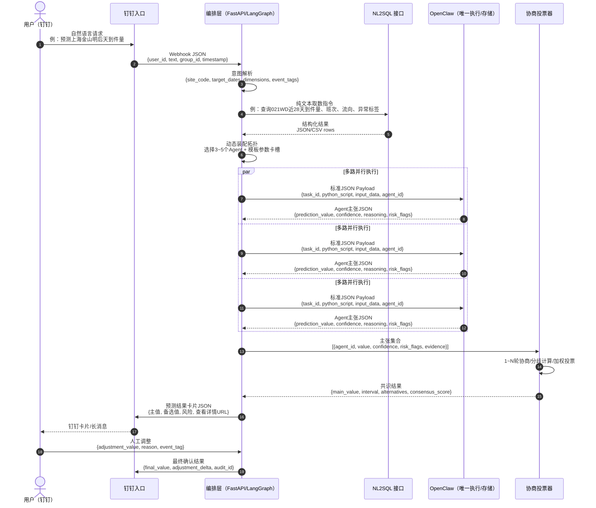

# 产品功能方案文档（PRD）：预测 Skills 工具箱

## 1.1 产品定位与核心价值 [P0]

「预测 Skills 工具箱」是面向多中转场地未来 2 天到件量预测的人机协同决策产品。产品以 `OpenClaw 为唯一执行主体 + 轻量编排层实现 Agent Swarm 协同` 为核心范式，将一线沉淀的人工预测经验抽象为可配置、可执行、可追溯的预测 Agent，通过多视角并行推演、协商投票、人工校验调整，输出“AI 算得准、人看得懂、业务调得动”的预测结果。

核心公式：

```text
最终预测值 = 集群共识最优值 + 人工校验调整
集群共识最优值 = f(各 Agent 独立预测 → 主张聚合 → 协商辩论 → 加权投票)
单 Agent 预测 = 计算框架 × 计算方法 × 维度细分
```

核心价值点：

| 核心价值 | 做什么 | 为什么 | 怎么用 |
|---|---|---|---|
| 多视角预测 | 每次动态选择 3~5 个 Agent 并行预测 | 单一模型难覆盖大客户促销、倒货、天气、规划变更等场景 | 用户在钉钉发起预测后，系统展示本次参与 Agent、选中理由与各自预测值 |
| 白盒决策 | 展示数据、模板、参数、代码摘要、中间结果、投票过程 | 解决业务“不敢用、不会用”的信任问题 | 用户点击任一预测值，可穿透查看完整推导链路 |
| 人机协同 | AI 负责拉数、执行、校验、预警；业务负责异常判断与最终确认 | 调研显示人工经验有效但未标准化，且外部动态信息仍需人工输入 | 人工校验台支持输入调整值、调整原因、事件标签 |
| 经验沉淀 | 将 15 套人工方案抽象为框架、方法、维度、校验策略 | 避免人员流动导致经验流失，支持跨场地复用 | 预测管理员在模板配置台维护方案卡槽与默认参数 |
| 自主进化 | 基于历史误差、人工修正幅度、执行异常更新 Agent 权重 | 让系统越用越贴近场地真实运营规律 | Agent 表现分析台展示历史准确率、权重变化、采纳率 |

与传统单模型预测的差异：

| 对比项 | 传统单模型预测 | 预测 Skills 工具箱 |
|---|---|---|
| 预测逻辑 | 单一模型输出点预测 | 多 Agent 多方案并行推演，协商后收敛 |
| 业务覆盖 | 偏历史时序，突发事件响应弱 | 支持大客户、倒货、规划变更、天气、班次等场景修正 |
| 可解释性 | 黑盒结果，难说明变化原因 | 展示输入数据、模板参数、代码摘要、协商过程 |
| 人工角色 | 被动接收或线下修正 | 在线校验、调整、确认，并沉淀为后续路由记忆 |
| 方案维护 | 按场地或模型硬编码 | 参数化组合：计算框架 × 计算方法 × 维度细分 |
| 异常处理 | 模型失真后人工兜底 | 超时、异常、离群自动降级，并标记降级事件 |

## 1.2 用户角色与使用场景 [P0]

| 用户角色 | 核心诉求 | 权限边界 |
|---|---|---|
| 场地运营 | 快速获取所属场地未来 2 天预测，并理解为什么这么预测 | 查看本场地预测、展开详情、提交人工调整 |
| 区域经理 | 横向比较多个场地风险，识别高分歧、高波动、高人工介入场地 | 查看区域场地汇总、风险排序、采纳率与偏差趋势 |
| 预测管理员 | 维护预测模板、Agent 权重、路由规则与验收指标 | 配置模板卡槽、管理 Agent 注册表、查看执行审计 |

User Story：

| 用户角色 | User Story | 验收要点 |
|---|---|---|
| 场地运营 | As a 场地运营, I want to 在钉钉输入“预测明后天到件量”, so that 我能直接获得本场地 T+1/T+2 主预测值和风险提示。 | 默认识别用户所属场地；返回预测主值、置信区间、备选方案和风险提示 |
| 场地运营 | As a 场地运营, I want to 查看每个 Agent 的推导逻辑, so that 我能判断预测是否符合现场情况。 | 可展开 Agent 主张、数据窗口、模板参数、代码摘要、输入数据摘要 |
| 场地运营 | As a 场地运营, I want to 输入“大客户明天加单 2 万”, so that 系统能把人工信息纳入最终预测。 | 支持调整值、调整原因、事件标签；保留调整前后差异 |
| 区域经理 | As a 区域经理, I want to 查看区域内预测分歧最高的场地, so that 我能提前介入运力和人力排布风险。 | 展示分歧指数、风险标签、共识失败/降级事件 |
| 预测管理员 | As a 预测管理员, I want to 配置“框架 × 方法 × 维度”的模板, so that 新场地无需硬编码即可复用成熟方案。 | 支持模板启停、参数默认值、适用场地类型、历史效果查看 |

## 1.3 功能模块划分 [P0]

| 模块名 | 功能描述 | 用户角色 | 交互入口 | 优先级 |
|---|---|---|---|---|
| 钉钉对话入口 | 接收自然语言预测请求，返回预测卡片、长消息、详情链接；支持人工调整指令 | 场地运营、区域经理 | 钉钉机器人/群聊/单聊 | P0 |
| OpenClaw 原生对话入口 | 作为补充入口接收标准预测文本指令，并转交编排层处理；不参与预测代码生成、计算或存储改造 | 场地运营、预测管理员 | OpenClaw 原生对话 | P1 |
| 意图路由中心 | 识别场地、日期、预测粒度、业务事件；判断运行模式：模型兜底+修正、人工主导+校验、远期全自动 | 场地运营、预测管理员 | 钉钉触发，后台自动执行 | P0 |
| 协同决策看板 | 展示本次参与 Agent、选中理由、主张对比、协商轮次、投票权重、共识结果 | 场地运营、区域经理 | 钉钉“查看详情” | P0 |
| 人工校验台 | 支持人工输入调整值、调整原因、事件标签、确认/驳回系统建议 | 场地运营 | 钉钉卡片按钮、详情页 | P0 |
| 预测模板配置台 | 管理计算框架、计算方法、维度细分、校验策略、模板版本与参数卡槽 | 预测管理员 | Web 管理页 | P0 |
| Agent 表现分析台 | 展示 Agent 历史准确率、MAPE、采纳率、降级次数、权重变化趋势 | 区域经理、预测管理员 | Web 管理页 | P1 |
| 决策轨迹审计页 | 回放任务解析、取数、Agent 执行、协商、投票、人工调整全过程 | 区域经理、预测管理员 | Web 管理页 | P1 |
| 异常事件标注台 | 维护天气、促销、规划变更、倒货、功能调整等业务事件标签 | 场地运营、预测管理员 | 详情页/Web 管理页 | P1 |
| 区域风险总览 | 按区域汇总未来 2 天高风险场地、分歧场地、低置信场地 | 区域经理 | Web 看板/钉钉日报 | P2 |

Agent 自主性在产品上的显性呈现：

| 自主能力 | 产品呈现 |
|---|---|
| 自主组织 | 详情页展示“本次参与 Agent 列表 + 选中理由 + 未选中原因” |
| 自主决策 | 展示各轮主张变化、分歧指数、最终投票权重 |
| 自主容错 | 展示 OpenClaw 超时、异常、离群、降级替代方案 |
| 自主进化 | Agent 表现分析台展示历史准确率排行和路由权重变化 |

## 1.4 核心交互流程 [P0]



流程输入/输出规范：

| 环节 | 输入 | 输出 | 用户可见信息 |
|---|---|---|---|
| 钉钉触发 | 自然语言文本 | 标准请求 JSON | 请求已受理、目标场地、目标日期 |
| 意图路由 | user_id、文本、上下文 | site_code、target_date、运行模式 | 识别到的场地与预测范围 |
| NL2SQL 取数 | 纯文本查询指令 | JSON/CSV 数据集 | 数据窗口、数据完整度、缺失字段 |
| 动态装配 | 场地画像、数据质量、事件标签 | 3~5 个 Agent 执行拓扑 | Agent 列表与选中理由 |
| OpenClaw 执行 | Python 脚本 Payload | Agent 主张 JSON | 预测值、置信度、依据、风险 |
| 协商投票 | 主张集合 | 主值、备选值、分歧指数 | 协商摘要、投票权重 |
| 人工校验 | 调整值、理由、标签 | 最终预测值 | 调整前后对比、审计记录 |

## 1.5 核心页面与组件原型 [P1]

### 钉钉预测结果卡片

| 字段/组件 | 类型 | 展示规则 | 说明 |
|---|---|---|---|
| 场地与日期 | 文本 | `021WD 上海金山 / T+1、T+2` | 默认展示用户所属场地未来 2 天 |
| 预测主值 | 数值 | 大字号展示，如 `985,000 件` | 集群共识最优值，不含或含人工调整需明确标注 |
| 置信区间 | 文本 | `P80: 94.2万 ~ 101.8万` | [待业务确认: 默认置信区间=P80] |
| 备选方案参考值 | 列表 | 展示 Top 3 Agent 方案 | 按排序规则展示 |
| Agent 共识度 | 进度/标签 | `高/中/低` 或百分比 | [待业务确认: 默认高共识阈值=0.75] |
| 关键风险提示 | 标签 | 如“大客户摸底缺失”“晚到车占比高” | 最多展示 3 条，高风险置顶 |
| 降级事件标记 | 标签 | 如“HistoryMirror 超时，已用 B2 兜底” | 仅发生异常时展示 |
| 操作按钮 | 按钮 | 查看详情、人工调整、确认采纳 | 钉钉卡片交互 |

### 决策详情页

| 区域 | 组件 | 字段 |
|---|---|---|
| 总览区 | 主值卡片 | 预测主值、人工调整值、最终值、置信区间、共识度 |
| Agent 主张对比面板 | 表格/条形图 | Agent 名称、预测值、偏差率、置信度、历史准确率、风险标签 |
| 协商过程时间线 | Timeline | 第 0 轮原始主张、第 1~N 轮修正、分歧指数变化、最终投票 |
| 代码片段折叠区 | 折叠面板 | 模板名称、版本号、关键参数、Python 代码摘要、OpenClaw 产物引用 |
| 数据输入摘要 | 表格 | 数据窗口、数据行数、缺失率、异常值、NL2SQL 指令摘要 |
| 降级与异常区 | Alert | 超时 Agent、失败原因、替代策略、是否影响主值 |
| 审计区 | 时间线 | 发起人、发起时间、确认人、人工调整原因、最终确认时间 |

Agent 主张对比字段：

| 字段 | 示例 |
|---|---|
| Agent ID | `TrendFollower` |
| 参数组合 | `趋势外推 × 7日加权移动平均 × 场地整体` |
| 预测值 | `123,500` |
| 置信度 | `0.82` |
| 历史 MAPE | `8.6%` |
| 与主值偏差 | `+3.2%` |
| 核心依据 | `近7日斜率 +180/天，无异常事件标记` |
| 风险提示 | `上游A流向近2日缺失` |
| 代码引用 | `template://trend_wma_7d_v2.py` |

### 人工调整面板

| 字段/控件 | 类型 | 校验规则 |
|---|---|---|
| 调整方式 | 单选 | 加减值 / 覆盖最终值 / 按比例调整 |
| 调整值 | 数字输入 | 支持正负；超过主值 ±10% 需二次确认 [待业务确认: 默认=10%] |
| 调整原因 | 必填文本 | 不少于 5 个字 |
| 事件标签 | 多选 | 大客户促销、倒货、天气、规划变更、设备异常、其他 |
| 影响日期 | 日期选择 | 默认 T+1/T+2 |
| 附件/备注 | 可选 | 支持上传截图或群聊信息摘要 [待业务确认] |
| 提交动作 | 按钮 | 提交后生成审计记录，并回写本次任务 |

## 1.6 预测结果展示规范 [P1]

### 主值展示规则

| 规则 | 说明 |
|---|---|
| 主值口径 | 默认展示“集群共识最优值”；若已人工调整，则展示“最终预测值 = 共识值 + 调整值” |
| 日期范围 | 默认 T+1、T+2；支持用户指定日期 [待业务确认: 默认最多查询未来7天] |
| 精度表达 | 必须同时展示点预测、置信区间、置信度 |
| 风险绑定 | 主值旁必须展示最高优先级风险标签 |
| 人工状态 | 明确标识“未确认 / 已人工调整 / 已确认采纳” |

### 备选方案排序规则

备选方案按综合得分排序：

```text
综合得分 = 0.4 × 当前置信度 + 0.4 × 历史准确率 + 0.2 × 稳定性得分 - 偏离惩罚
```

[待业务确认: 默认权重为 0.4/0.4/0.2]

| 排序因子 | 解释 |
|---|---|
| 当前置信度 | Agent 本次输出的 confidence |
| 历史准确率 | 同场地、同场景、同预测期的历史表现 |
| 稳定性得分 | 近 N 次预测波动程度 [待业务确认: 默认N=30] |
| 偏离惩罚 | 与主值偏差超过阈值时降权 [待业务确认: 默认阈值=15%] |

### 分歧高亮规则

| 分歧状态 | 触发条件 | 展示方式 |
|---|---|---|
| 低分歧 | 分歧指数 ≤ 0.10 | 绿色标签：共识稳定 |
| 中分歧 | 0.10 < 分歧指数 ≤ 0.20 | 黄色标签：建议复核 |
| 高分歧 | 分歧指数 > 0.20 | 红色标签：需要人工介入 |
| 极端离群 | 单 Agent 与中位数偏差 > 30% | 标记离群，不直接参与主值投票 [待业务确认: 默认=30%] |

分歧指数默认定义：

```text
分歧指数 = Agent预测值标准差 / Agent预测值均值
```

### 可解释穿透规则

用户点击任一预测值后，必须按以下顺序展开：

| 层级 | 展示内容 |
|---|---|
| 1. 使用的数据 | 数据来源、NL2SQL 指令摘要、数据窗口、缺失率、异常值 |
| 2. 使用的模板 | 框架、方法、维度、模板版本、适用场景 |
| 3. 参数值 | 权重、基期、窗口长度、事件修正系数 |
| 4. 计算过程 | 关键中间值、分项预测值、汇总逻辑 |
| 5. 输出值 | 原始预测值、置信度、风险提示、与主值偏差 |
| 6. 审计引用 | OpenClaw 执行任务 ID、代码片段引用、结果文件引用 |

禁止展示项：

| 禁止项 | 原因 |
|---|---|
| OpenClaw 内置 LLM 生成/修改预测代码的过程 | 违反“OpenClaw 仅执行，不生成预测逻辑”的边界 |
| 编排层自行计算的预测中间值 | 违反“计算归 OpenClaw”的架构铁律 |
| 无来源的口头结论 | 影响业务信任与审计追溯 |

## 1.7 验收标准与业务指标 [P1]

### 功能验收标准

| 功能项 | 验收条件 | 验证方法 |
|---|---|---|
| 钉钉预测触发 | 用户输入自然语言后，系统能识别场地、日期并返回预测卡片 | 使用 20 条真实话术测试，识别成功率 ≥ 95% |
| 默认未来 2 天预测 | 未指定日期时，默认返回 T+1/T+2 | 钉钉回归测试 |
| 动态 Agent 装配 | 每次任务根据场地画像、数据质量、事件标签选择 3~5 个 Agent | 查看任务详情中的 Agent 列表和选中理由 |
| Agent 主张结构化输出 | 每个 Agent 必须输出预测值、置信度、依据、风险、输入摘要、代码引用 | 抽检 OpenClaw 返回 JSON |
| 协商投票可见 | 详情页展示协商轮次、主张变化、分歧指数、投票权重 | UI 验收 + 审计日志比对 |
| 人工调整闭环 | 用户可提交调整值和原因，系统生成最终值并保留审计记录 | 提交测试调整，检查最终卡片与审计页 |
| 降级事件提示 | Agent 超时、异常、离群时不中断主流程，并展示替代策略 | 模拟 OpenClaw 超时/异常 |
| 可解释穿透 | 任一预测值可展开数据、模板、参数、计算过程、输出值 | 页面走查 |
| Agent 表现分析 | 可查看 Agent 历史 MAPE、采纳率、降级次数、权重趋势 | 使用历史任务样本回放 |
| 权限边界 | 场地运营只能查看所属场地，区域经理查看区域，管理员管理模板 | 权限用例测试 |

### 业务效果指标

| 指标名 | 计算方式 | 基线值 [待业务确认] | 目标值 |
|---|---|---|---|
| 预测准确率（MAPE） | `平均(|预测值-实际值|/实际值)` | 黄田参考：人工 93.2% 准确率、模型 95.4% 准确率 | MVP 阶段 MAPE ≤ 10%；稳定期较人工基线下降 10% |
| 决策耗时 | 从钉钉发起到返回主预测卡片的时间 | [待业务确认: 默认基线=人工 Excel 30~60 分钟] | 常规场景 ≤ 3 分钟；复杂场景 ≤ 8 分钟 |
| 人工介入率 | `人工调整任务数 / 总预测任务数` | [待业务确认: 默认基线=100%] | 平峰场景 ≤ 30%；高风险场景允许升高 |
| 共识收敛成功率 | `成功输出主值任务数 / 总任务数` | [待业务确认: 默认基线=无] | ≥ 95% |
| 用户采纳率 | `确认采纳预测结果数 / 返回预测结果数` | [待业务确认: 默认基线=无] | ≥ 70% |
| 高分歧识别召回率 | `被标记高分歧且实际偏差超阈值任务数 / 实际偏差超阈值任务数` | [待业务确认: 默认偏差阈值=15%] | ≥ 80% |
| 降级可恢复率 | `降级后仍成功输出可用结果任务数 / 发生降级任务数` | [待业务确认: 默认基线=无] | ≥ 90% |
| 解释查看率 | `查看详情次数 / 预测卡片返回次数` | [待业务确认: 默认基线=无] | 试点期 ≥ 40%，稳定期逐步下降代表信任提升 |
| 人工调整沉淀率 | `带结构化原因的调整数 / 人工调整总数` | [待业务确认: 默认基线=0] | ≥ 90% |

业务验收补充：

| 场景 | 必须覆盖的产品能力 |
|---|---|
| 大客户临时促销 | 支持人工录入摸底量，主值展示调整前后差异 |
| 规划变更 | 支持事件标签，触发事件型 Agent 或人工校验门禁 |
| 兜底型场地溢出 | 支持高分歧标红、备选方案对比、人工最终拍板 |
| 双代码人力共享 | 支持关联场地提示与合并风险摘要 [待业务确认] |
| 极端天气 | 不强行给出单点确定结论，允许区间预测和高风险标记 |
