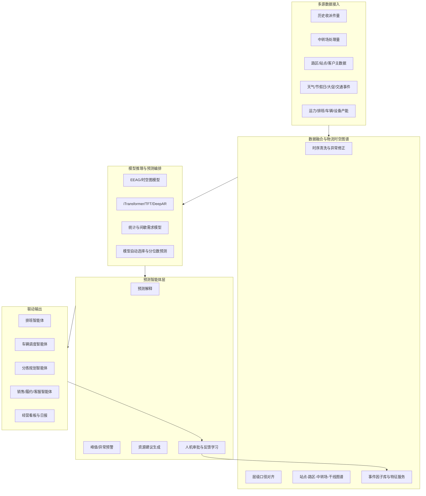

# 物流快递预测智能体全球调研报告

调研日期：2026-05-14  
调研对象：全球供应链计划、物流可视化、物流执行编排、需求预测与 Agentic AI 产品  
适用场景：快递收派量预测、中转场处理量预测、大促峰值预警、天气/节假日/突发事件异常预警

---

## 1. 执行摘要

全球同行并不完全使用“预测智能体”这一命名，主流表达包括 AI supply chain planning、demand sensing、decision intelligence、AI agents、AI teammates、digital workers、control tower agents 等。技术演进的方向非常明确：从“预测模型”升级为“预测 + 解释 + 场景推演 + 异常识别 + 调度执行”的闭环智能体。

对物流快递企业而言，预测智能体的核心经营价值不只是提升预测准确率，而是把预测转化为运营动作：提前排班、提前备车、提前调分拣资源、提前识别爆仓风险、提前向销售/履约/规划智能体推送约束和机会。头部厂商的价值表达也已经从“模型更准”转向“缺货减少、库存下降、计划周期缩短、计划员效率提升、异常自动闭环、服务水平提升”。

结合全球案例，快递预测智能体的差异化定位应聚焦在四点：

1. 物流网络时空建模：站点、路区、中转场、城市、大区、干线、客户、商圈之间存在强网络依赖，不能只用传统 SKU/门店预测方法。
2. 峰值经营保障：618、双11、黑五、圣诞等波峰的资源准备价值远高于普通日期的点预测。
3. 预测到执行闭环：预测结果要自动转成班次、车辆、分拣线、人力、临时场地和履约 SLA 建议。
4. Agentic 协同：预测智能体应作为销售、履约、规划、客服、异常处置等智能体的前置信号源和风险雷达。

---

## 2. 全球代表产品速览

| 厂商/产品 | 市场定位 | 与预测智能体相关能力 | 公开经营价值/提效证据 |
|---|---|---|---|
| Amazon Connect Decisions | Agentic supply chain planning and intelligence | AI teammates、需求预测、共识计划、供给计划、根因分析、持续学习 | AWS 称产品结合 Amazon 30 年运营科学、400M+ SKU 经验、25+ 供应链工具；用于从救火式运营转为主动运营 |
| Blue Yonder Cognitive Solutions / AI Agents | 端到端供应链认知决策平台 | AI/ML、Supply Chain Knowledge Graph、AI Agents、预测与执行协同 | Blue Yonder 称每天交付 25B+ AI predictions；Infineon 计划工作量下降 30%、预测周期从 4 周到 2 周、计划错误最多下降 90% |
| o9 Digital Brain | 企业计划大脑与知识图谱平台 | Enterprise Knowledge Graph、Demand Sensing、AI Agents、场景推演、Touchless Planning | AB InBev 缺货下降 60%、库存损失下降 53%、计划员节省 30% 时间；Kraft Heinz 月度预测准确率提升 11%、周度提升 14%、安全库存下降 20%、预测耗时下降 32% |
| Kinaxis Maestro Agents | 并发供应链编排与 AI Agents | Concurrent Planning、Maestro Agents、Agent Studio、异常监测、场景评估 | Kinaxis 称某全球药企计划员效率最高提升 10 倍，库存风险识别从 40 次点击降至 4 次 |
| Oracle Fusion Cloud SCM AI Agents | ERP/SCM 内嵌 AI 智能体 | AI Agent Studio、计划异常分析、订单/库存/物流智能体、Demand Management | Oracle 将 AI agents 嵌入计划、履约、库存、物流流程，用于自动化供应链流程与数据驱动决策 |
| SAP IBP + Joule | IBP 计划系统与生成式 AI 助手 | Demand Sensing、机器学习预测、Joule 解释、计划优化分析、物流管理助手 | SAP 称 Business AI 可带来最高 30% 生产力提升；IBP 预测结果分析可使预测运行分析生产力最高提升 25% |
| FedEx Dataworks | 物流网络数据智能与 agentic platform | FedEx 真实运输网络数据、预测信号、价值链编排、自动化 | 强调从 reactive visibility 转向 coordinated action，用预测智能和 agentic platform 连接物流决策 |
| DHL Supply Chain Orchestration | 仓配运营编排与 AI | 机器学习、数据分析、资源分配、工作流自动化、实时需求适配 | DHL 称标准化集成与编排层首批部署使实施时间最多下降 60%；AI 用于提升订单满足率和预防错误 |
| FourKites Intelligent Control Tower | AI 驱动供应链控制塔 | 实时网络、数字孪生、AI Digital Workers、预测预警与自动执行 | FourKites 称 3.2M+ 日处理货运、1.1M 承运商/供应商网络；公开展示异常自处理、准时交付提升、团队工时节省等价值 |
| project44 Movement | 运输可视化与决策智能平台 | 多式联运可视化、AI disruption alerts、Movement GPT、多智能体编排 | 价值集中在 ETA 风险预测、异常影响识别、运输协同和供应链中断处置 |

---

## 3. 关键行业趋势

### 3.1 从 Forecasting 到 Decision Intelligence

传统预测系统输出“未来件量是多少”；新一代系统输出“为什么变化、风险在哪里、应如何调整、谁来执行、执行后效果如何”。Amazon Connect Decisions、Blue Yonder、o9、Kinaxis、Oracle、SAP 都在把预测纳入供应链决策工作流，而不是把预测作为孤立报表。

对快递预测智能体的启发：预测结果必须联动经营动作。例如：

- 站点派件量 P90 超过产能阈值时，自动建议临时工、车辆、错峰到件和跨区支援。
- 中转场夜间处理量预测上升时，自动建议分拣线开停、格口调整、车辆到发节奏。
- 大促峰值预测上调时，自动推送销售、履约、客服、干线、末端智能体。

### 3.2 从单一模型到模型族和自动编排

AWS Forecast/AWS Supply Chain 公开资料显示，商业化预测系统通常采用多算法路线：深度学习、统计模型、机器学习、AutoML、需求驱动因子、分位数预测等并存。不同业务粒度、数据稀疏度和预测跨度需要不同模型。

建议快递预测智能体采用“模型族 + 自动选择 + 分层回退”：

- 高活跃站点/路区：时空图模型、iTransformer、TFT、DeepAR/TCN 类深度模型。
- 低频或冷启动站点：相似站点迁移、层级贝叶斯、聚类回退、规则模型。
- 间歇件量：Croston/ADIDA/IMAPA 类间歇需求模型。
- 大促/节假日：事件因子模型、场景模拟、分位数预测和峰值召回优化。
- 异常预警：预测残差监控、变点检测、天气/交通/舆情/客户活动因子归因。

### 3.3 知识图谱和数字孪生成为智能体底座

Blue Yonder 强调 Supply Chain Knowledge Graph，o9 强调 Enterprise Knowledge Graph，FourKites 强调 orders/shipments/inventory/assets/facilities 数字孪生。原因在于供应链不是线性时间序列，而是多节点、多约束、多依赖的网络系统。

快递场景建议构建“物流时空知识图谱”：

- 节点：站点、路区、城市、大区、中转场、客户、商圈、线路、车辆、人员、设备。
- 边：揽派归属、转运依赖、干线流向、跨区支援、客户履约关系、相似需求关系。
- 事件：天气、节假日、促销、大客户活动、交通管制、网点异常、仓库切换。
- 约束：站点人效、车效、分拣能力、场地容量、线路班次、SLA、成本预算。

### 3.4 Agent 层负责解释、协同和闭环

LLM/Agent 不应替代时序预测模型，而应负责模型之后的高价值工作：

- 解释：把模型输出、因子贡献、异常残差翻译成业务语言。
- 协同：把预测结果发送给排班、车辆、分拣、销售、客服、履约智能体。
- 执行：生成资源调整建议，必要时进入人工审批。
- 学习：记录建议是否被采纳、采纳后是否降低成本或提升服务，反哺模型。

---

## 4. 经营价值与提效降本框架

| 价值主题 | 物流快递业务含义 | 建议 KPI | 价值计算口径 |
|---|---|---|---|
| 运力成本下降 | 预测准则排班准、备车准，减少临时外包、无效加班、车辆空驶 | 人效、车效、临时工成本、加班小时、单票操作成本 | 节省成本 = 人工节省 + 车辆节省 + 外包节省 + 空驶下降 |
| 分拣资源优化 | 中转场提前知道波峰，优化开线、格口、月台和到发节奏 | 分拣产能匹配率、车辆等待时长、爆仓次数、错峰成功率 | 节省成本 = 等待时间下降 + 爆仓损失下降 + 设备/人力利用提升 |
| 大促峰值保障 | 618/双11 等高峰提前扩容，降低峰值失控风险 | 峰值预测召回率、P90 覆盖率、资源准备提前量、峰值承接率 | 收益 = 延误/赔付减少 + 大客户 SLA 保护 + 增量件承接 |
| 服务质量提升 | 预测偏离和异常提前预警，减少延误、漏派、投诉 | 妥投率、准点率、投诉率、延误赔付 | 收益 = 投诉/赔付下降 + 客户留存提升 |
| 管理效率提升 | 自动生成预测解释、日报、预警和资源建议 | 计划员工时、人工调参次数、异常闭环时长、预测报表自动化率 | 节省 = 计划/运营人员工时下降 |
| 收入保护与增长 | 识别产能瓶颈和销售机会，支撑大客户承诺 | 大客户履约 SLA、机会损失、销售可承诺产能 | 收益 = 大客户流失减少 + 可承接业务增加 |

---

## 5. 对当前预测智能体的定位建议

建议将当前定位从“预测工具”升级为：

> 面向快递物流网络的预测决策智能体，基于时空图模型、多源事件因子和大模型解释能力，预测站点、路区、中转场及大促峰值件量，并把预测结果转化为排班、车辆、分拣、履约和销售协同动作。

能力表达建议：

1. 高精度预测：保留 EEAG 93% 准确率、iTransformer 等模型能力，同时增加 WAPE、Bias、P90 覆盖率、峰值召回率等经营指标。
2. 低延迟推理：强调准实时预测、小时级/日内滚动更新、异常快速重算。
3. 多粒度覆盖：站点、路区、城市、大区、中转场、干线、客户维度统一建模。
4. 可解释性：输出关键因子、影响方向、影响程度、置信区间和业务口径说明。
5. A2A 联动：作为六智能体之一，向销售、履约、规划、调度、客服、异常处置智能体推送预测和风险。
6. 闭环学习：采纳率、执行效果、实际件量偏差、成本节省自动回流。

---

## 6. 推荐产品架构

---

## 7. 推荐建设路线

| 阶段 | 时间 | 建设目标 | 关键交付 |
|---|---:|---|---|
| P0 | 0-3 个月 | 预测可用 | 站点/路区/中转场日级预测，指标监控，基础报表 |
| P1 | 3-6 个月 | 解释可信 | 天气、节假日、大促、客户活动、历史偏差归因，自动预警 |
| P2 | 6-9 个月 | 决策联动 | 输出排班、车辆、分拣线、临时资源建议，接入其他智能体 |
| P3 | 9-12 个月 | 闭环优化 | 采纳率、成本节省、服务提升回流，形成自学习运营智能体 |

---

## 8. 参考来源

- [Amazon Connect Decisions](https://aws.amazon.com/products/connect/decisions/)
- [AWS Announces Amazon Connect Decisions](https://aws.amazon.com/about-aws/whats-new/2026/04/amazon-connect-decisions-april/)
- [AWS Supply Chain Demand Driver-Based Forecasting](https://aws.amazon.com/about-aws/whats-new/2024/02/aws-supply-chain-demand-planning-driver-forecasting/)
- [Amazon Forecast Algorithms](https://docs.aws.amazon.com/forecast/latest/dg/aws-forecast-choosing-recipes.html)
- [Blue Yonder AI Agents and Supply Chain Knowledge Graph](https://blueyonder.com/media/2025/blue-yonder-transforms-supply-chain-management-with-new-ai-agents)
- [o9 Demand Sensing](https://o9solutions.com/solutions/demand-sensing/)
- [o9 AB InBev Case Study](https://o9solutions.com/articles/ab-inbev-journey-with-o9-transforming-supply-chain-planning)
- [Kinaxis Maestro Agents](https://investors.kinaxis.com/news-releases/news-release-details/2025/Kinaxis-Accelerates-Agentic-Era-for-Supply-Chain-Orchestration-with-the-Launch-of-Maestro-Agents/default.aspx)
- [Oracle SCM AI Agents](https://www.oracle.com/news/announcement/ai-world-oracle-ai-agents-help-supply-chain-leaders-boost-operational-efficiency-2025-10-15/)
- [SAP Demand Sensing Help Portal](https://help.sap.com/docs/SAP_INTEGRATED_BUSINESS_PLANNING/feae3cea3cc549aaa9d9de7d363a83e6/26578154c2652357e10000000a44176d.html)
- [SAP Business AI Supply Chain](https://www.sap.com/mena/products/scm/ai.html)
- [FedEx Dataworks](https://www.fedex.com/en-us/dataworks.html)
- [DHL Supply Chain Orchestration, Robotics and AI](https://www.dhl.com/us-en/home/press/press-archive/2024/dhl-supply-chain-continues-to-innovate-with-orchestration-robotics-and-ai-in-2024.html)
- [FourKites Intelligent Control Tower](https://www.fourkites.com/products)
- [project44 Movement](https://www.project44.com/mo/)
- [iTransformer, ICLR 2024](https://proceedings.iclr.cc/paper_files/paper/2024/hash/2ea18fdc667e0ef2ad82b2b4d65147ad-Abstract-Conference.html)
- [Temporal Fusion Transformers](https://arxiv.org/abs/1912.09363)
