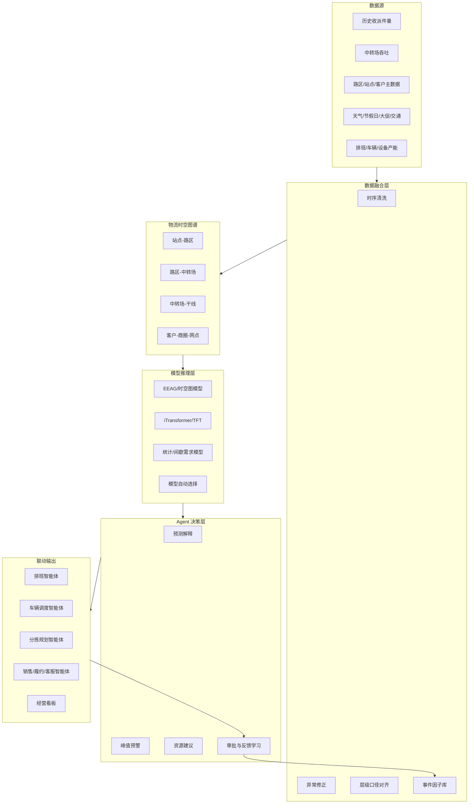
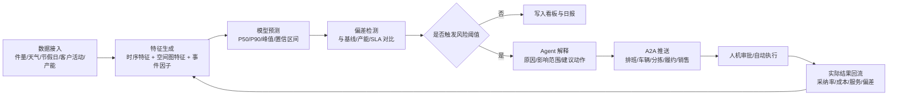
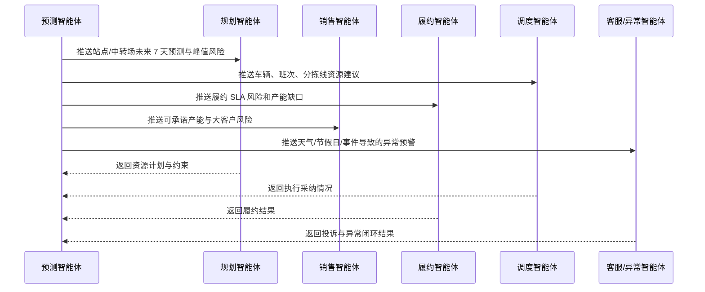
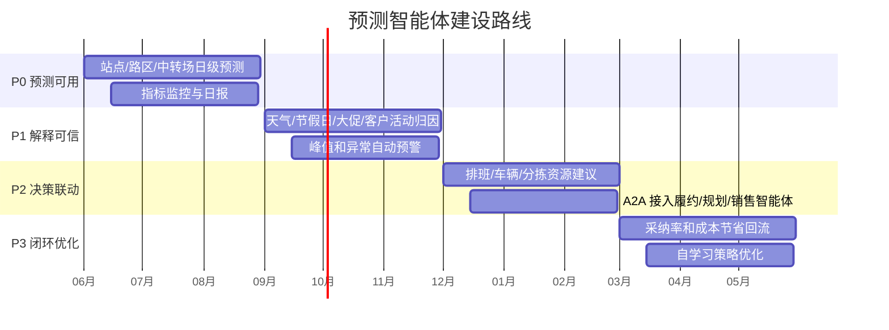

# 物流快递预测智能体全球调研汇报

文档形式：PPT 汇报稿 Markdown  
建议页数：15 页  
汇报对象：业务负责人、运营负责人、技术负责人、智能体平台负责人  
汇报目标：说明预测智能体的行业趋势、经营价值、技术架构和建设路线

---

## Slide 1｜标题页

# 物流快递预测智能体全球调研与建设建议

副标题：从“预测模型”到“预测决策智能体”的经营价值闭环  
日期：2026-05-14

**讲稿提示**  
本次汇报聚焦全球供应链与物流领域的 AI 预测产品、智能体趋势和可量化经营价值，并给出面向快递收派、中转、大促和异常预警场景的产品建设建议。

---

## Slide 2｜一句话结论

# 行业正在从“预测数值”进入“预测到行动”

**核心判断**

- 头部厂商不再只卖 forecast accuracy，而是卖计划效率、成本下降、服务水平提升和异常闭环。
- AI Agents 的价值不是替代预测模型，而是把预测结果解释清楚、推给正确系统、转成可执行动作。
- 快递行业的差异化机会在于站点、路区、中转场、干线、客户和事件的时空网络预测。

**页内视觉建议**  
横向演进箭头：报表预测 → 智能预测 → 解释预警 → 资源建议 → A2A 执行闭环。

---

## Slide 3｜行业产品版图

# 全球代表产品集中在三类能力

| 类型 | 代表产品 | 主要价值 |
|---|---|---|
| 供应链计划智能体 | Amazon Connect Decisions、Blue Yonder、o9、Kinaxis、Oracle、SAP | 需求预测、计划协同、场景推演、异常根因分析 |
| 物流控制塔智能体 | FourKites、project44、FedEx Dataworks | ETA 预测、运输风险识别、异常协同、物流可视化到行动 |
| 仓配/执行编排智能体 | DHL Supply Chain Orchestration、Manhattan、Blue Yonder WMS/TMS | 人员、设备、仓配、订单、车辆资源优化 |

**讲稿提示**  
快递预测智能体不是一个孤立模型，应该横跨计划、控制塔和执行编排三类能力。

---

## Slide 4｜对标产品价值证据

# 经营价值是全球头部产品的共同叙事

| 产品 | 公开价值证据 |
|---|---|
| Blue Yonder | 每日 25B+ AI predictions；Infineon 计划工作量下降 30%、预测周期从 4 周降至 2 周、计划错误最多下降 90% |
| o9 | AB InBev 缺货下降 60%、库存损失下降 53%、计划员节省 30% 时间；Kraft Heinz 月度预测准确率提升 11%、周度提升 14% |
| Kinaxis | 某全球药企计划员效率最高提升 10 倍，库存风险识别从 40 次点击降至 4 次 |
| SAP | Business AI 最高 30% 生产力提升；IBP 预测运行分析最高 25% 生产力提升 |
| DHL | 编排层首批部署使实施时间最多下降 60%；AI 用于提升订单满足率和减少错误 |

**讲稿提示**  
这些案例证明，预测智能体的 KPI 不能只看准确率，要看成本、效率、服务、风险和收入保护。

---

## Slide 5｜快递场景价值翻译

# 把预测准确率转化为人、车、场、线、钱

| 快递场景 | 预测输出 | 经营动作 | 价值指标 |
|---|---|---|---|
| 站点/路区收派量 | 明日/未来 7 天件量、P50/P90、偏差风险 | 排班、临时工、跨区支援 | 人效、加班小时、派件准点率 |
| 中转场处理量 | 分小时/分波次吞吐预测 | 开线、格口、月台、车辆到发 | 爆仓次数、车等时、单票处理成本 |
| 大促峰值 | 峰值日期、峰值量、风险范围 | 提前扩容、提前备车、客户承诺 | 峰值承接率、SLA、赔付下降 |
| 异常预警 | 天气/事件/客户导致的预测偏离 | 提前预案、客服提示、履约协同 | 异常闭环时长、投诉率 |

---

## Slide 6｜目标定位

# 预测智能体定位：物流网络的前置经营雷达

> 面向快递物流网络的预测决策智能体，基于时空图模型、多源事件因子和大模型解释能力，预测站点、路区、中转场及大促峰值件量，并把预测结果转化为排班、车辆、分拣、履约和销售协同动作。

**产品关键词**

- 高精度：EEAG/iTransformer/时空图模型，面向物流网络优化。
- 低延迟：批量预测 + 日内滚动重算 + 准实时异常检测。
- 多粒度：站点、路区、中转场、城市、大区、客户、线路。
- 可解释：因子归因、置信区间、峰值原因、业务语言说明。
- 可联动：通过 A2A 对接排班、调度、履约、规划、销售智能体。

---

## Slide 7｜系统架构图

# 预测智能体参考架构

---

## Slide 8｜预测到执行流程图

# 从数据到动作的闭环流程

**讲稿提示**  
闭环的关键是让“预测偏差”不止停留在图表中，而是进入运营系统，成为可执行任务。

---

## Slide 9｜A2A 智能体协同图

# 预测智能体作为六智能体的前置信号源

---

## Slide 10｜核心技术路线

# 模型层要从单模型升级为模型族

| 问题类型 | 推荐模型/方法 | 输出 |
|---|---|---|
| 高活跃站点/路区预测 | EEAG、ST-GNN、iTransformer、TFT | 多步预测、置信区间 |
| 中转场吞吐预测 | 时空图模型、TCN、Transformer、波次模型 | 分小时/分波次吞吐 |
| 大促峰值预测 | 事件因子模型、分位数预测、相似活动迁移 | P90/P95 峰值、提前预警 |
| 冷启动/低频站点 | 相似站点迁移、聚类回退、层级模型 | 可用预测和置信评级 |
| 异常预警 | 残差检测、变点检测、因果归因、LLM 解释 | 风险等级、原因、建议 |

**讲稿提示**  
技术亮点不只是一种模型，而是“多模型自动编排 + 业务约束 + Agent 解释执行”。

---

## Slide 11｜经营价值测算框架

# 提效降本可以用五类指标承接

| 价值项 | 指标 | 测算方式 |
|---|---|---|
| 人力节省 | 加班小时、临时工成本、计划员工时 | 基线成本 - 智能体上线后成本 |
| 车辆节省 | 空驶率、等车时长、临时外包车 | 空驶/等待下降 × 单位成本 |
| 场线效率 | 爆仓次数、开线匹配率、设备利用率 | 爆仓损失下降 + 设备利用提升 |
| 服务提升 | 准点率、投诉率、赔付金额 | 赔付下降 + 客户留存收益 |
| 收入保护 | 峰值承接率、大客户 SLA、可承诺产能 | 损失订单减少 + 增量业务承接 |

**页内视觉建议**  
用“准确率 → 资源匹配 → 成本/服务/收入”的三段价值链图。

---

## Slide 12｜产品能力蓝图

# 建议按四层能力打造产品

| 层级 | 能力 | 产品化表现 |
|---|---|---|
| L1 预测基础层 | 多粒度预测、模型监控、指标看板 | 每日预测报表、WAPE/Bias/峰值召回 |
| L2 解释预警层 | 因子归因、异常检测、自然语言说明 | 预测变化原因、风险等级、影响范围 |
| L3 决策建议层 | 资源建议、场景推演、成本影响 | 班次/车辆/分拣线建议，方案对比 |
| L4 智能体联动层 | A2A 推送、审批执行、反馈学习 | 跨智能体任务、采纳率、闭环 ROI |

---

## Slide 13｜实施路线

# 12 个月从预测工具升级为经营智能体

---

## Slide 14｜落地优先级

# 先打高价值闭环，再扩展全网智能化

| 优先级 | 场景 | 原因 |
|---|---|---|
| P0 | 中转场处理量预测 + 峰值预警 | 资源成本高、爆仓风险大、经营价值直观 |
| P0 | 站点/路区派件量预测 | 直接影响排班、人效和末端服务 |
| P1 | 大促峰值预测 | 管理层关注度高，适合证明系统价值 |
| P1 | 异常天气/节假日偏离预警 | 可快速联动客服、履约和调度 |
| P2 | 销售可承诺产能预测 | 从降本扩展到收入保护和增长 |

---

## Slide 15｜决策建议

# 建议立项为“预测决策智能体”，而非单点预测模型

**三条建议**

1. 产品定位：预测智能体 = 物流网络经营雷达 + 资源建议引擎 + A2A 协同信号源。
2. 技术路线：时空图模型为核心，模型族自动编排为底座，LLM/Agent 负责解释、协同和闭环。
3. 价值证明：用人力、车辆、分拣、服务、峰值承接、收入保护等经营指标证明 ROI。

**结束语**

预测智能体的真正价值，是让业务从“看到问题”提前到“预判问题”，再进一步到“自动组织资源解决问题”。

---

## 附录｜可引用来源

- Amazon Connect Decisions：https://aws.amazon.com/products/connect/decisions/
- Blue Yonder AI Agents：https://blueyonder.com/media/2025/blue-yonder-transforms-supply-chain-management-with-new-ai-agents
- o9 Demand Sensing：https://o9solutions.com/solutions/demand-sensing/
- Kinaxis Maestro Agents：https://investors.kinaxis.com/news-releases/news-release-details/2025/Kinaxis-Accelerates-Agentic-Era-for-Supply-Chain-Orchestration-with-the-Launch-of-Maestro-Agents/default.aspx
- Oracle SCM AI Agents：https://www.oracle.com/news/announcement/ai-world-oracle-ai-agents-help-supply-chain-leaders-boost-operational-efficiency-2025-10-15/
- SAP Supply Chain AI：https://www.sap.com/mena/products/scm/ai.html
- FedEx Dataworks：https://www.fedex.com/en-us/dataworks.html
- DHL Supply Chain AI：https://www.dhl.com/us-en/home/press/press-archive/2024/dhl-supply-chain-continues-to-innovate-with-orchestration-robotics-and-ai-in-2024.html
- FourKites Products：https://www.fourkites.com/products
- project44 Movement：https://www.project44.com/mo/
