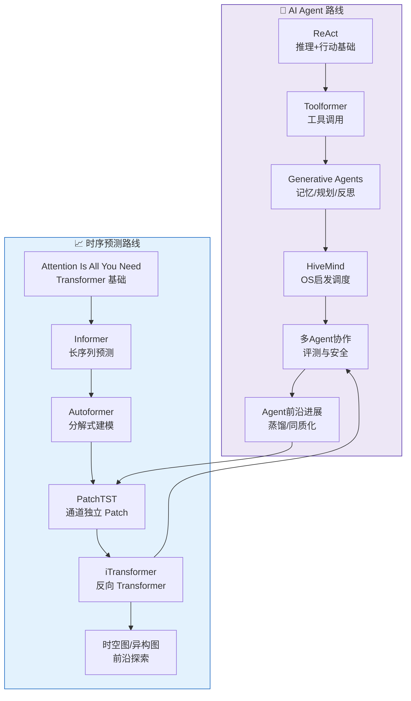

# 🗺️ 阅读路线图

## 双路线全景



---

## 里程碑

### 🐣 入门阶段
**目标**：理解 Agent 和时序预测的基础概念

- [x] ReAct / Attention Is All You Need（基础概念）
- [x] Toolformer / Informer（核心机制）
- [x] Generative Agents（架构全景）

**标志**：能用自己的话解释 CoT / Self-Attention 是什么

### 🐥 进阶阶段
**目标**：掌握主流模型的核心原理和适用场景

- [ ] HiveMind（并发调度）
- [ ] Autoformer（分解式）
- [ ] PatchTST（高效长序列）

**标志**：能判断一个新模型属于哪类，适合哪种数据

### 🐔 实践阶段
**目标**：将论文方法论落地到物流预测场景

- [ ] 为顺丰某场景设计 Agent 调度方案
- [ ] 用 PatchTST 验证某网点预测精度
- [ ] 建立预测-规划 Agent A2A 联动方案

**标志**：有可以直接上线的方案文档

### 🦅 前沿阶段
**目标**：跟踪最新进展，保持技术敏锐度

- [ ] 每周精读 1-2 篇前沿论文
- [ ] 将新方法论加入路线图
- [ ] 在 [经典必读](guides/classics.md) 追加里程碑笔记

---

## 学习顺序建议

### 如果你时间有限（先学这个）

```
AI Agent: HiveMind → ReAct 入门 → Agent 评测基础
时序预测: Informer → Attention 基础 → PatchTST
```

### 如果你想系统建立知识体系

```
AI Agent: 入门三篇 → HiveMind → Agent 调度 → Agent 安全 → 前沿
时序预测: Attention/Informer → Autoformer → PatchTST/iTransformer → 时空图
```

---

## 本周推荐学习计划

| 天 | AI Agent | 时序预测 |
|----|---------|---------|
| Day 1 | ReAct 入门 | Attention Is All You Need |
| Day 2 | HiveMind 精读 | Informer 精读 |
| Day 3 | When Agents Look the Same | PatchTST 论文 |
| Day 4 | Spatial Atlas | iTransformer 论文 |
| Day 5 | 经典必读补充笔记 | 经典必读补充笔记 |
| Day 6-7 | 本周论文回顾 + 路线更新 | 本周论文回顾 + 路线更新 |
