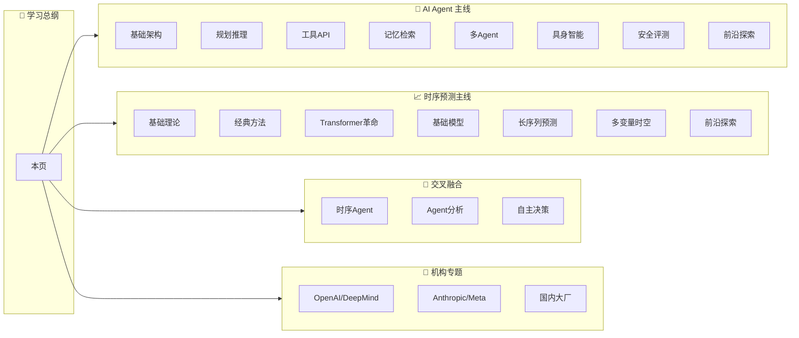

# 📖 学习总纲

> **总入口** — 从这里规划你的完整学习路径，串联所有论文。

---

## 🗺️ 知识全景图

---

## 🌱 阶段一：基础入门（0-3个月）

### AI Agent 方向 — 必读 5 篇

| 序号 | 论文 | 机构 | 核心主题 | 状态 | 入口 |
|------|------|------|---------|------|------|
| 1.1 | ReAct: 推理+行动协同 | Princeton / Google | CoT→ReAct 基础范式 | 📖 经典必读 | [agents/ch01-basics.md](agents/ch01-basics.md) |
| 1.2 | Toolformer: 工具调用 | Meta | Agent调用外部API的原型 | 📖 经典必读 | [agents/ch03-tools.md](agents/ch03-tools.md) |
| 1.3 | Generative Agents | Stanford / Google | 记忆/规划/反思三段式 | 📖 经典必读 | [agents/ch04-memory.md](agents/ch04-memory.md) |
| 1.4 | Chain-of-Thought Prompting | Google / OpenAI | 思维链提示 | 📖 经典必读 | [agents/ch02-planning.md](agents/ch02-planning.md) |
| 1.5 | Reflexion: 语言智能体 | MIT | 语言反馈强化学习 | 📖 经典必读 | [agents/ch01-basics.md](agents/ch01-basics.md) |

### 时序预测方向 — 必读 5 篇

| 序号 | 论文 | 机构 | 核心主题 | 状态 | 入口 |
|------|------|------|---------|------|------|
| 1.1 | Transformer (Attention Is All You Need) | Google | Attention机制基础 | 📖 经典必读 | [time_series/ch03-transformer.md](time_series/ch03-transformer.md) |
| 1.2 | Informer | AAAI 2021 | 长时序高效Transformer | 🔄 待处理 | [time_series/ch03-transformer.md](time_series/ch03-transformer.md) |
| 1.3 | Autoformer | NeurIPS 2021 | 自相关分解机制 | 🔄 待处理 | [time_series/ch03-transformer.md](time_series/ch03-transformer.md) |
| 1.4 | PatchTST | ICLR 2022 | 分块时序Transformer | 🔄 待处理 | [time_series/ch05-long-horizon.md](time_series/ch05-long-horizon.md) |
| 1.5 | iTransformer | NeurIPS 2024 | 反向Transformer(倒置) | 🔄 待处理 | [time_series/ch03-transformer.md](time_series/ch03-transformer.md) |

---

## 🚀 阶段二：进阶提升（3-6个月）

### AI Agent 进阶核心

| 专题方向 | 代表论文数 | 关键论文 |
|---------|-----------|---------|
| 规划与推理 | 3+ | Tree of Thoughts, Graph of Thoughts, Plan-and-Solve |
| 工具使用与API | 3+ | Function Calling, Gorilla, ToolBench |
| 记忆与检索 | 2+ | MemoryBank, RET-LLM, Generative Agents |
| 多智能体协作 | 3+ | CAMEL, AutoGen, ChatDev, MetaGPT |

详细见：[AI Agent 主线 → 进阶章节](agents/index.md)

### 时序预测进阶核心

| 专题方向 | 代表论文数 | 关键论文 |
|---------|-----------|---------|
| 基础模型(Foundation Models) | 4+ | Time-LLM, Chronos, Moirai, TimesFM, Lag-Llama |
| 长序列预测优化 | 3+ | LogTrans, Reformer, BigST |
| 多变量时空建模 | 3+ | MTGNN, GTS, STGNN综述 |

详细见：[时序预测主线 → 进阶章节](time_series/index.md)

---

## 🏆 阶段三：专家研究（6-12个月）

### 前沿研究方向

| 方向 | 核心问题 | 相关论文 |
|------|---------|---------|
| 时序基础模型 | LLM如何做时序预测？ | Time-LLM, Chronos, TimesFM, Moirai |
| 自主Agent | Agent如何自主决策？ | AutoGPT, Generative Agents, Voyager |
| 交叉融合 | 时序×Agent的边界在哪？ | [交叉融合领域](cross_domain/index.md) |
| Agent安全 | 如何保证Agent安全可控？ | SWE-agent, ATBench, Owner-Harm |

详细见：[前沿探索篇](agents/ch08-frontier.md) · [前沿探索篇](time_series/ch07-frontier.md)

---

## 📊 当前进度总览

### 按主线统计

| 主线 | 已精读 | 待处理 | 完成率 |
|------|--------|--------|--------|
| 🤖 **AI Agent** | 4 篇 | 24 篇 | 14% |
| 📈 **时序预测** | 0 篇 | 4 篇 | 0% |
| 🔗 **交叉领域** | 0 篇 | 0 篇 | - |
| **合计** | **4** | **28** | **12.5%** |

### 按机构统计（已收录）

| 机构 | 收录数 | 已精读 | 最新论文日期 |
|------|--------|--------|-------------|
| **OpenAI** | 7 | 3 | 2026-04-18 |
| **DeepSeek** | 5 | 0 | 2026-04-23 |
| **阿里通义** | 4 | 0 | 2026-04-21 |
| **MiniMax** | 4 | 0 | 2026-04-23 |
| **Meta FAIR** | 4 | 0 | 2026-04-23 |
| **Microsoft** | 2 | 0 | 2026-04-20 |
| **智谱 GLM** | 3 | 0 | 2026-04-24 |
| **Anthropic** | 3 | 1 | 2026-04-22 |
| **学术机构** | 1 | 0 | - |

> 详细按机构浏览见 [机构专题](organizations/index.md)

---

## 🎯 推荐行动

1. **新用户**：从 [AI Agent 基础架构篇](agents/ch01-basics.md) 或 [时序基础理论篇](time_series/ch01-basics.md) 开始
2. **每日跟进**：查看 [今日更新](guides/daily-guide.md)，了解最新发现的论文
3. **系统学习**：按照本总纲的阶段划分，逐章推进
4. **深度阅读**：每篇论文都有中文精读笔记，点击进入详情页
