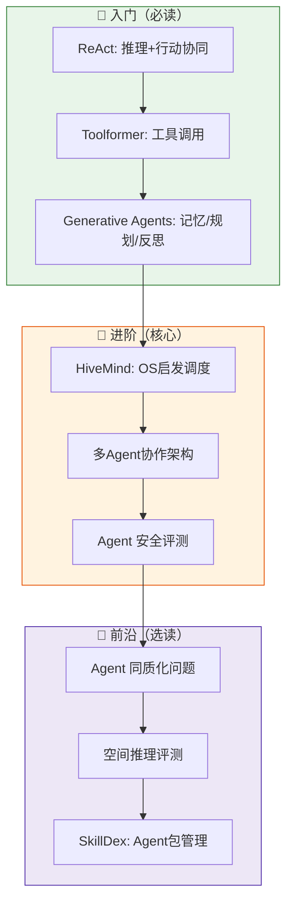

# 🧠 AI Agent 智能体学习路线

## 路线定位

本路线围绕**顺丰预测底盘智能体体系**设计，服务于 17 个 Agent 业务场景、7 类 Skills、Tools 工具集的实际构建需求。

学习目标：建立对 Agent 核心能力的系统认知，能将论文方法论落地到物流预测场景。

---

## 为什么要学这条路？

顺丰预测底盘正在构建的 Agent 体系面临三个核心问题：

| 核心问题 | 对应论文方向 |
|---------|-------------|
| 多 Agent 并发调度导致 API 限速失败 | **并发调度** — HiveMind |
| 蒸馏模型越来越多，行为同质化，无法差异化选型 | **Agent 评测** — When Agents Look the Same |
| Agent 缺乏空间/物理常识，benchmark 评测失真 | **Agent 评测范式** — Spatial Atlas |
| 多 Agent 协作产生资源竞争和通信开销 | **多 Agent 架构** |
| Agent 安全边界模糊（自我危害、跨会话攻击） | **Agent 安全** |

---

## 学习路径图

---

## 当前进度

| 状态 | 数量 | 说明 |
|------|------|------|
| ✅ 已完成精读 | 3 篇 | HiveMind、When Agents Look the Same、Spatial Atlas |
| 📖 入门推荐 | 3 篇 | ReAct、Toolformer、Generative Agents（经典必读） |
| 🔄 待处理 | 26 篇 | 按优先级排列，每日自动化补充 |

---

## ✅ 已精读论文

### 🐝 HiveMind: OS 启发的 LLM Agent 并发调度
**OpenAI** · 2026-04-18 · 优先级 ⭐⭐⭐⭐⭐

> 11 个并行 Agent 共享限速 API，27% 失败率。HiveMind 用 5 个 OS 调度原语（准入控制/速率限制跟踪/AIMD 背压/Token 预算/优先级队列）将失败率降至 0-18%。

**核心价值**：多 Agent 资源调度问题在物流场景同样存在——多个预测 Agent、规划 Agent 同时请求底盘 API，资源竞争直接影响调度时效。

[开始阅读 →](papers/2604.17111v1/index.md){ .md-button }

### 🪞 When Agents Look the Same: 蒸馏诱导的行为同质化
**Anthropic** · 2026-04-23 · 优先级 ⭐⭐⭐⭐

> 模型蒸馏在提升 Agent 能力的同时，也导致了严重的行为同质化。论文提出 RPS（响应模式相似度）和 AGS（行为图相似度）双指标体系。

**核心价值**：在为顺丰选型 Agent 时，如何评估不同 Agent 的差异化能力？如何避免"所有 Agent 看起来都一样"的选型陷阱？

[开始阅读 →](papers/2604.21255v1/index.md){ .md-button }

### 🗺️ Spatial Atlas: 空间感知 Agent 评测范式
**OpenAI** · 2026-04-13 · 优先级 ⭐⭐⭐⭐

> 提出 CGR（Compute-Grounded Reasoning）范式：每个子问题先由确定性计算解决，再交给 LLM 生成。解决 Agent benchmark 中"LLM 幻觉空间推理"的问题。

**核心价值**：物流场景中，空间推理（网点选址、路径规划、仓储布局）是 Agent 决策的关键。CGR 范式提示我们：先算后想，减少 LLM 的不确定推理。

[开始阅读 →](papers/2604.12102v2/index.md){ .md-button }

---

## 📖 入门推荐（经典必读）

> 这些是 Agent 领域的奠基性工作，不追新，只追根基。

| 论文 | 机构 | 核心价值 | 推荐理由 |
|------|------|---------|---------|
| **ReAct** | Google / Princeton | 推理 + 行动协同 | CoT → ReAct 是 Agent 基础范式 |
| **Toolformer** | Meta AI | 工具调用能力 | 顺丰 Agent 调用外部 API 工具的原型 |
| **Generative Agents** | Google / Stanford | 记忆/规划/反思三段式 | 物流 Agent 的长时记忆架构参考 |

详细见 [经典必读页面](../../guides/classics.md){ .md-button }

---

## 🔗 关联知识库

- 顺丰预测智能体体系：17 场景、6 大能力、7 类 Skills（本地文件）
- OpenClaw Agent 框架设计（本地文件）
- Skill 实时调用设计（本地文件）

---

## 下一步

[→ 进入入门篇：Agent 基础概念](getting-started.md){ .md-button }
