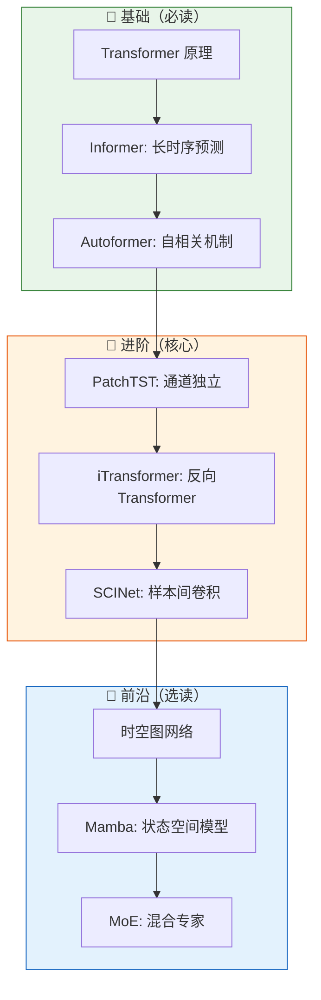

# 📈 时序预测深度学习路线

## 路线定位

本路线围绕**顺丰业务量预测**场景设计，服务于大网/业务区/网点/中转/航空枢纽各级预测模型的技术选型需求。

学习目标：建立对时序预测深度学习模型的系统认知，能根据不同预测场景（短时/长时/多变量/时空）选择合适模型。

---

## 为什么要学这条路？

顺丰预测业务面临的核心挑战：

| 核心挑战 | 对应模型方向 |
|---------|-------------|
| 网点级别预测误差 ±20% | 轻量化模型 / 迁移学习 |
| 长周期预测（7-14天）精度衰减 | Transformer / Informer / Autoformer |
| 多源数据融合（天气/促销/舆情） | 多模态时序 / 异构图网络 |
| 城市间流向预测 ±25% | 时空图神经网络 |

---

## 学习路径图

---

## 当前进度

| 状态 | 数量 | 说明 |
|------|------|------|
| ✅ 已完成精读 | 0 篇 | 路线规划中，即将开始 |
| 📖 入门推荐 | 3 篇 | Transformer/Informer/Autoformer |
| 🔄 待处理 | 30+ 篇 | 按优先级排列 |

---

## 📖 入门推荐

> 先修基础，循序渐进

| 论文 | 机构 | 核心价值 | 推荐理由 |
|------|------|---------|---------|
| **Transformer** | Google | Attention 机制 | 时序 Transformer 系列基础 |
| **Informer** | AAAI 2021 | 长时序预测 | 突破 O(n²) 复杂度 |
| **Autoformer** | NeurIPS 2021 | 自相关机制 | 工业级预测模型 |

详细见 [经典必读页面](../../guides/classics.md){ .md-button }

---

## 下一步

[→ 进入入门篇：时序预测基础概念](getting-started.md){ .md-button }
