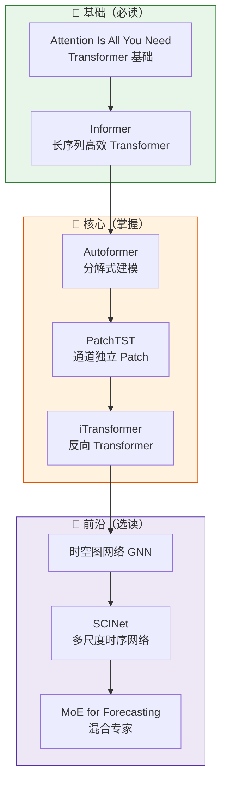

# 📈 时序预测深度学习路线

## 路线定位

本路线围绕**顺丰业务量预测**的实际需求设计：大网/业务区/网点/中转/航空枢纽的件量预测，KPI 标准 ±8%~±25%。

学习目标：从传统时序方法过渡到深度学习方法，建立对主流模型的系统认知，能够判断哪种模型适合哪种预测场景。

---

## 为什么要学这条路？

顺丰预测体系当前面临的挑战：

| 核心挑战 | 对应模型方向 |
|---------|-------------|
| 长序列预测（168h+）Transformer 复杂度 $O(L^2)$ | **Informer / Autoformer** — 高效长序列 |
| 多场地协同预测（时空相关性） | **时空图网络 / iTransformer** |
| 季节性分解（节假日/高峰/平日） | **Autoformer / PatchTST** |
| 小样本场地（网点级别）数据稀缺 | **预训练 + 微调范式** |
| 实时更新（每小时滚动预测） | **PatchTST / SCINet** |

---

## 学习路径图

---

## 当前进度

| 状态 | 数量 | 说明 |
|------|------|------|
| ✅ 已完成精读 | 0 篇 | 路线刚建立，等待论文补充 |
| 📖 入门推荐 | 2 篇 | Attention Is All You Need、Informer（经典必读） |
| 🔄 待处理 | 4 篇 | 当前数据库中的时序相关论文 |

---

## 📖 入门推荐（经典必读）

| 论文 | 机构 | 核心价值 | 推荐理由 |
|------|------|---------|---------|
| **Attention Is All You Need** | Google Brain | Transformer 基础 | 时序 Transformer 论文都以此为基础 |
| **Informer** | Huawei Cloud | 长序列预测 | AAAI 2021 Best Paper，时序预测里程碑 |

详细见 [经典必读页面](../../guides/classics.md){ .md-button }

---

## 🔗 关联知识库

- 预测业务全景：大网/业务区/网点/中转/航空枢纽 → [专业知识库-顺丰预测数据分析.md](../../../../../.workbuddy/memory/专业知识库-顺丰预测数据分析.md)
- 件量预测技术方案：PatchTST、多源融合、时空大模型 → 同上文档
- 风险波动预警机制：动静波动智能体 → 同上文档

---

## 下一步

[→ 进入入门篇：Transformer 基础与时序预测](getting-started.md){ .md-button }
